################################################
Text Classification Algorithms: A Survey
################################################

|DOI| |medium| |mendeley| |contributions-welcome| |arXiv| |ansicolortags| |contributors| 
  
  
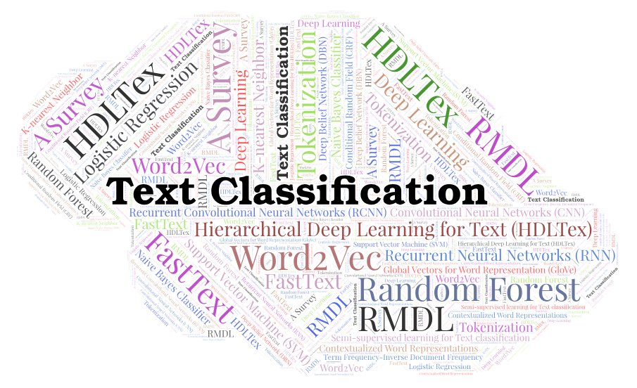
 
 
 Referenced paper : `Text Classification Algorithms: A Survey <https://arxiv.org/abs/1904.08067>`__

##################
Table of Contents
##################
.. contents::
  :local:
  :depth: 4

============
Introduction
============

.. figure:: docs/pic/OverviewTextClassification.png 

    
    
====================================
Text and Document Feature Extraction
====================================

----

Text feature extraction and pre-processing for classification algorithms are very significant. In this section, we start to talk about text cleaning since most of documents contain a lot of noise. In this part, we discuss two primary methods of text feature extractions- word embedding and weighted word.

~~~~~~~~~~~~~~~~~~~~~~~~~~~~~~~~
Text Cleaning and Pre-processing
~~~~~~~~~~~~~~~~~~~~~~~~~~~~~~~~

In Natural Language Processing (NLP), most of the text and documents contain many words that are redundant for text classification, such as stopwords, miss-spellings, slangs, and etc. In this section, we briefly explain some techniques and methods for text cleaning and pre-processing text documents. In many algorithms like statistical and probabilistic learning methods, noise and unnecessary features can negatively affect the overall perfomance. So, elimination of these features are extremely important.

-------------
Tokenization
-------------

Tokenization is the process of breaking down a stream of text into words, phrases, symbols, or any other meaningful elements called tokens. The main goal of this step is to extract individual words in a sentence. Along with text classifcation, in text mining, it is necessay to incorporate a parser in the pipeline which performs the tokenization of the documents; for example:

sentence:

.. code::

  After sleeping for four hours, he decided to sleep for another four

In this case, the tokens are as follows:

.. code::

    {'After', 'sleeping', 'for', 'four', 'hours', 'he', 'decided', 'to', 'sleep', 'for', 'another', 'four'}

Here is python code for Tokenization:

.. code:: python

  from nltk.tokenize import word_tokenize
  text = "After sleeping for four hours, he decided to sleep for another four"
  tokens = word_tokenize(text)
  print(tokens)

-----------
Stop words
-----------

Text and document classification over social media, such as Twitter, Facebook, and so on is usually affected by the noisy nature (abbreviations, irregular forms) of the text corpuses.

Here is an exmple from  `geeksforgeeks <https://www.geeksforgeeks.org/removing-stop-words-nltk-python/>`__

.. code:: python

  from nltk.corpus import stopwords
  from nltk.tokenize import word_tokenize

  example_sent = "This is a sample sentence, showing off the stop words filtration."

  stop_words = set(stopwords.words('english'))

  word_tokens = word_tokenize(example_sent)

  filtered_sentence = [w for w in word_tokens if not w in stop_words]

  filtered_sentence = []

  for w in word_tokens:
      if w not in stop_words:
          filtered_sentence.append(w)

  print(word_tokens)
  print(filtered_sentence)

Output:

.. code:: python 

  ['This', 'is', 'a', 'sample', 'sentence', ',', 'showing', 
  'off', 'the', 'stop', 'words', 'filtration', '.']
  ['This', 'sample', 'sentence', ',', 'showing', 'stop',
  'words', 'filtration', '.']

---------------
Capitalization
---------------

Sentences can contain a mixture of uppercase and lower case letters. Multiple sentences make up a text document. To reduce the problem space, the most common approach is to reduce everything to lower case. This brings all words in a document in same space, but it often changes the meaning of some words, such as "US" to "us" where first one represents the United States of America and second one is a pronoun. To solve this, slang and abbreviation converters can be applied.

.. code:: python

  text = "The United States of America (USA) or America, is a federal republic composed of 50 states"
  print(text)
  print(text.lower())

Output:

.. code:: python

  "The United States of America (USA) or America, is a federal republic composed of 50 states"
  "the united states of america (usa) or america, is a federal republic composed of 50 states"

-----------------------
Slangs and Abbreviations
-----------------------

Slangs and abbreviations can cause problems while executing the pre-processing steps. An abbreviation  is a shortened form of a word, such as SVM stand for Support Vector Machine. Slang is a version of language that depicts informal conversation or text that has different meaning, such as "lost the plot", it essentially means that 'they've gone mad'. Common method to deal with these words is converting them to formal language.

---------------
Noise Removal
---------------

Another issue of text cleaning as a pre-processing step is noise removal. Text documents generally contains characters like punctuations or  special characters and they are not necessary for text mining or classification purposes. Although punctuation is critical to understand the meaning of the sentence, but it can affect the classification algorithms negatively.

Here is simple code to remove standard noise from text:

.. code:: python

  def text_cleaner(text):
      rules = [
          {r'>\s+': u'>'},  # remove spaces after a tag opens or closes
          {r'\s+': u' '},  # replace consecutive spaces
          {r'\s*<br\s*/?>\s*': u'\n'},  # newline after a  
          {r'</(div)\s*>\s*': u'\n'},  # newline after 
 and 
 and <h1/>...
          {r'</(p|h\d)\s*>\s*': u'\n\n'},  # newline after 
 and 
 and <h1/>...
          {r'<head>.*<\s*(/head|body)[^>]*>': u''},  # remove <head> to </head>
          {r'<a\s+href="([^"]+)"[^>]*>.*</a>': r'\1'},  # show links instead of texts
          {r'[ \t]*<[^<]*?/?>': u''},  # remove remaining tags
          {r'^\s+': u''}  # remove spaces at the beginning
      ]
      for rule in rules:
      for (k, v) in rule.items():
          regex = re.compile(k)
          text = regex.sub(v, text)
      text = text.rstrip()
      return text.lower()
    

-------------------
Spelling Correction
-------------------

An optional part of the pre-processing step is correcting the misspelled words. Different techniques, such as hashing-based and context-sensitive spelling correction techniques, or  spelling correction using trie and damerau-levenshtein distance bigram have been introduced to tackle this issue.

.. code:: python

  from autocorrect import spell

  print spell('caaaar')
  print spell(u'mussage')
  print spell(u'survice')
  print spell(u'hte')

Result:

.. code::

    caesar
    message
    service
    the

------------
Stemming
------------

Text Stemming is modifying a word to obtain its variants using different linguistic processeses like affixation (addition of affixes). For example, the stem of the word "studying" is "study", to which -ing.

Here is an example of Stemming from `NLTK <https://pythonprogramming.net/stemming-nltk-tutorial/>`__

.. code:: python

    from nltk.stem import PorterStemmer
    from nltk.tokenize import sent_tokenize, word_tokenize

    ps = PorterStemmer()

    example_words = ["python","pythoner","pythoning","pythoned","pythonly"]
    
    for w in example_words:
    print(ps.stem(w))

Result:

.. code::

  python
  python
  python
  python
  pythonli

-------------
Lemmatization
-------------

Text lemmatization is the process of eliminating redundant prefix or suffix of a word and extract the base word (lemma).

.. code:: python

  from nltk.stem import WordNetLemmatizer

  lemmatizer = WordNetLemmatizer()

  print(lemmatizer.lemmatize("cats"))

~~~~~~~~~~~~~~
Word Embedding
~~~~~~~~~~~~~~

Different word embedding procedures have been proposed to translate these unigrams into consummable input for machine learning algorithms. A very simple way to perform such embedding is term-frequency~(TF) where each word will be mapped to a number corresponding to the number of occurrence of that word in the whole corpora. The other term frequency functions have been also used that represent word-frequency as Boolean or logarithmically scaled number. Here, each document will be converted to a vector of same length containing the frequency of the words in that document. Although such approach may seem very intuitive but it suffers from the fact that particular words that are used very commonly in language literature might dominate this sort of word representations.

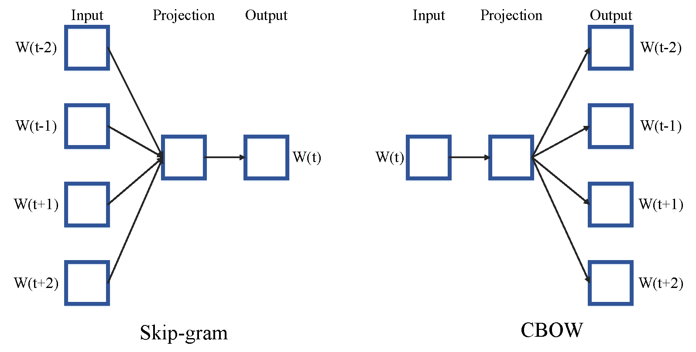

--------
Word2Vec
--------

Original from https://code.google.com/p/word2vec/

I’ve copied it to a github project so that I can apply and track community
patches (starting with capability for Mac OS X
compilation).

-  **makefile and some source has been modified for Mac OS X
   compilation** See
   https://code.google.com/p/word2vec/issues/detail?id=1#c5
-  **memory patch for word2vec has been applied** See
   https://code.google.com/p/word2vec/issues/detail?id=2
-  Project file layout altered

There seems to be a segfault in the compute-accuracy utility.

To get started:

::

   cd scripts && ./demo-word.sh

Original README text follows:

This tool provides an efficient implementation of the continuous bag-of-words and skip-gram architectures for computing vector representations of words. These representations can be subsequently used in many natural language processing applications and for further research purposes. 

this code provides an implementation of the Continuous Bag-of-Words (CBOW) and
the Skip-gram model (SG), as well as several demo scripts.

Given a text corpus, the word2vec tool learns a vector for every word in
the vocabulary using the Continuous Bag-of-Words or the Skip-Gram neural
network architectures. The user should specify the following: -
desired vector dimensionality (size of the context window for
either the Skip-Gram or the Continuous Bag-of-Words model),  training
algorithm (hierarchical softmax and / or negative sampling), threshold
for downsampling the frequent words, number of threads to use,
format of the output word vector file (text or binary).

Usually, other hyper-parameters, such as the learning rate do not
need to be tuned for different training sets.

The script demo-word.sh downloads a small (100MB) text corpus from the
web, and trains a small word vector model. After the training is
finished, users can interactively explore the similarity of the
words.

More information about the scripts is provided at
https://code.google.com/p/word2vec/

----------------------------------------------
Global Vectors for Word Representation (GloVe)
----------------------------------------------

.. image:: /docs/pic/Glove.PNG

An implementation of the GloVe model for learning word representations is provided, and describe how to download web-dataset vectors or train your own. See the  `project page <http://nlp.stanford.edu/projects/glove/>`__  or the   `paper <http://nlp.stanford.edu/pubs/glove.pdf>`__  for more information on glove vectors.

------------------------------------
Contextualized Word Representations
------------------------------------

ELMo is a deep contextualized word representation that models both (1) complex characteristics of word use (e.g., syntax and semantics), and (2) how these uses vary across linguistic contexts (i.e., to model polysemy). These word vectors are learned functions of the internal states of a deep bidirectional language model (biLM), which is pre-trained on a large text corpus. They can be easily added to existing models and significantly improve the state of the art across a broad range of challenging NLP problems, including question answering, textual entailment and sentiment analysis.

**ELMo representations are:**

-  **Contextual:** The representation for each word depends on the entire context in which it is used.
-  **Deep:** The word representations combine all layers of a deep pre-trained neural network.
-  **Character based:** ELMo representations are purely character based, allowing the network to use morphological clues to form robust representations for out-of-vocabulary tokens unseen in training.

**Tensorflow implementation**

Tensorflow implementation of the pretrained biLM used to compute ELMo representations from `"Deep contextualized word representations" <http://arxiv.org/abs/1802.05365>`__.

This repository supports both training biLMs and using pre-trained models for prediction.

We also have a pytorch implementation available in `AllenNLP <http://allennlp.org/>`__.

You may also find it easier to use the version provided in `Tensorflow Hub <https://www.tensorflow.org/hub/modules/google/elmo/2>`__ if you just like to make predictions.

**pre-trained models:**

We have got several pre-trained English language biLMs available for use. Each model is specified with two separate files, a JSON formatted "options" file with hyperparameters and a hdf5 formatted file with the model weights. Links to the pre-trained models are available `here <https://allennlp.org/elmo>`__.

There are three ways to integrate ELMo representations into a downstream task, depending on your use case.

1. Compute representations on the fly from raw text using character input. This is the most general method and will handle any input text. It is also the most computationally expensive.
2. Precompute and cache the context independent token representations, then compute context dependent representations using the biLSTMs for input data. This method is less computationally expensive then #1, but is only applicable with a fixed, prescribed vocabulary.
3. Precompute the representations for your entire dataset and save to a file.

We have used all of these methods in the past for various use cases. #1 is necessary for evaluating at test time on unseen data (e.g. public SQuAD leaderboard). #2 is a good compromise for large datasets where the size of the file in is unfeasible (SNLI, SQuAD). #3 is a good choice for smaller datasets or in cases where you'd like to use ELMo in other frameworks.

In all cases, the process roughly follows the same steps. First, create a ``Batcher`` (or ``TokenBatcher`` for #2) to translate tokenized strings to numpy arrays of character (or token) ids. Then, load the pretrained ELMo model (class ``BidirectionalLanguageModel``). Finally, for steps #1 and #2 use ``weight_layers`` to compute the final ELMo representations. For #3, use ``BidirectionalLanguageModel`` to write all the intermediate layers to a file.

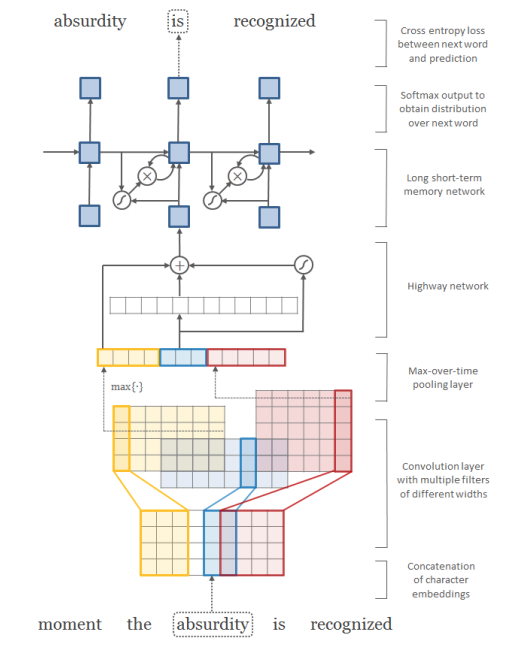
Architecture of the language model applied to an example sentence [Reference:  `arXiv paper <https://arxiv.org/pdf/1508.06615.pdf>`__]. 

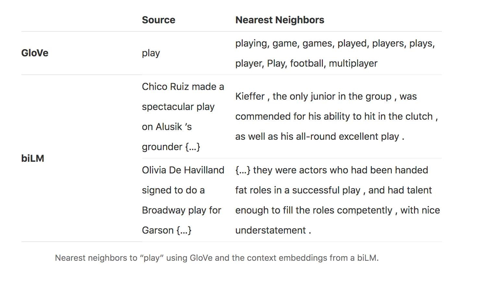

--------
FastText
--------

fastText is a library for efficient learning of word representations and sentence classification.

**Github:**  `facebookresearch/fastText <https://github.com/facebookresearch/fastText>`__

**Models**

-  Recent state-of-the-art `English word vectors <https://fasttext.cc/docs/en/english-vectors.html>`__.
-  Word vectors for `157 languages trained on Wikipedia and Crawl <https://github.com/facebookresearch/fastText/blob/master/docs/crawl-vectors.md>`__.
-  Models for `language identification <https://fasttext.cc/docs/en/language-identification.html#content>`__ and `various supervised tasks <https://fasttext.cc/docs/en/supervised-models.html#content>`__.

**Supplementary data :**

-  The preprocessed `YFCC100M data <https://fasttext.cc/docs/en/dataset.html#content>`__ .

**FAQ**

You can find `answers to frequently asked questions <https://fasttext.cc/docs/en/faqs.html#content>`__ on Their project `website <https://fasttext.cc/>`__.

**Cheatsheet**

Also a `cheatsheet <https://fasttext.cc/docs/en/cheatsheet.html#content>`__ is provided full of useful one-liners.

~~~~~~~~~~~~~~
Weighted Words
~~~~~~~~~~~~~~

--------------
Term frequency
--------------

Term frequency is Bag of words that is one of the simplest techniques of text feature extraction. This method is based on counting number of the words in each document and assign it to feature space.

-----------------------------------------
Term Frequency-Inverse Document Frequency
-----------------------------------------
The mathematical representation of weight of a term in a document by Tf-idf is given:

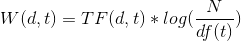
   
Where N is number of documents and df(t) is the number of documents containing the term t in the corpus. The first part would improve recall and the later would improve the precision of the word embedding. Although tf-idf tries to overcome the problem of common terms in document, it still suffers from some other descriptive limitations. Namely, tf-idf cannot account for the similarity between words in the document since each word is presented as an index. In the recent years, with development of more complex models, such as neural nets, new methods has been presented that can incorporate concepts, such as similarity of words and part of speech tagging. This work uses, word2vec and Glove, two of the most common methods that have been successfully used for deep learning techniques.

.. code:: python

    from sklearn.feature_extraction.text import TfidfTransformer
    def loadData(X_train, X_test,MAX_NB_WORDS=75000):
        vectorizer_x = TfidfVectorizer(max_features=MAX_NB_WORDS)
        X_train = vectorizer_x.fit_transform(X_train).toarray()
        X_test = vectorizer_x.transform(X_test).toarray()
        print("tf-idf with",str(np.array(X_train).shape[1]),"features")
        return (X_train,X_test)
   
   
~~~~~~~~~~~~~~~~~~~~~~~~~~~~~~~~~~~~~~~~~~~
Comparison of Feature Extraction Techniques
~~~~~~~~~~~~~~~~~~~~~~~~~~~~~~~~~~~~~~~~~~~

+---------------------------------------+----------------------------------------------------------------------------------------------------------------------------------------------------------+----------------------------------------------------------------------------------------------------------------+
|                **Model**              |                                                                        **Advantages**                                                                    |                                                   **Limitation**                                               |
+---------------------------------------+----------------------------------------------------------------------------------------------------------------------------------------------------------+----------------------------------------------------------------------------------------------------------------+
|            **Weighted Words**         |  * Easy to compute                                                                                                                                       |  * It does not capture the position in the text (syntactic)                                                    |
|                                       |                                                                                                                                                          |                                                                                                                |
|                                       |  * Easy to compute the similarity between 2 documents using it                                                                                           |  * It does not capture meaning in the text (semantics)                                                         |
|                                       |                                                                                                                                                          |                                                                                                                |
|                                       |  * Basic metric to extract the most descriptive terms in a document                                                                                      |                                                                                                                |
|                                       |                                                                                                                                                          |  * Common words effect on the results (e.g., “am”, “is”, etc.)                                                 |
|                                       |  * Works with an unknown word (e.g., New words in languages)                                                                                             |                                                                                                                |
+---------------------------------------+----------------------------------------------------------------------------------------------------------------------------------------------------------+----------------------------------------------------------------------------------------------------------------+
|            **TF-IDF**                 |  * Easy to compute                                                                                                                                       |  * It does not capture the position in the text (syntactic)                                                    |
|                                       |                                                                                                                                                          |                                                                                                                |
|                                       |                                                                                                                                                          |                                                                                                                |
|                                       |  * Easy to compute the similarity between 2 documents using it                                                                                           |  * It does not capture meaning in the text (semantics)                                                         |
|                                       |                                                                                                                                                          |                                                                                                                |
|                                       |                                                                                                                                                          |                                                                                                                |
|                                       |  * Basic metric to extract the most descriptive terms in a document                                                                                      |                                                                                                                |
|                                       |                                                                                                                                                          |                                                                                                                |
|                                       |                                                                                                                                                          |                                                                                                                |
|                                       |  * Common words do not affect the results due to IDF (e.g., “am”, “is”, etc.)                                                                            |                                                                                                                |
+---------------------------------------+----------------------------------------------------------------------------------------------------------------------------------------------------------+----------------------------------------------------------------------------------------------------------------+
|               **Word2Vec**            |  * It captures the position of the words in the text (syntactic)                                                                                         |  * It cannot capture the meaning of the word from the text (fails to capture polysemy)                         |
|                                       |                                                                                                                                                          |                                                                                                                |
|                                       |  * It captures meaning in the words (semantics)                                                                                                          |  * It cannot capture out-of-vocabulary words from corpus                                                       |
+---------------------------------------+----------------------------------------------------------------------------------------------------------------------------------------------------------+----------------------------------------------------------------------------------------------------------------+
|         **GloVe (Pre-Trained)**       |  * It captures the position of the words in the text (syntactic)                                                                                         |  * It cannot capture the meaning of the word from  the text (fails to capture polysemy)                        |
|                                       |                                                                                                                                                          |                                                                                                                |
|                                       |  * It captures meaning in the words (semantics)                                                                                                          |                                                                                                                |
|                                       |                                                                                                                                                          |  * Memory consumption for storage                                                                              |
|                                       |  * Trained on huge corpus                                                                                                                                |                                                                                                                |
|                                       |                                                                                                                                                          |                                                                                                                |
|                                       |                                                                                                                                                          |  * It cannot capture out-of-vocabulary words from corpus                                                       |
+---------------------------------------+----------------------------------------------------------------------------------------------------------------------------------------------------------+----------------------------------------------------------------------------------------------------------------+
|           **GloVe (Trained)**         |  * It is very straightforward, e.g., to enforce the word vectors to capture sub-linear relationships in the vector space (performs better than Word2vec) |  * Memory consumption for storage                                                                              |
|                                       |                                                                                                                                                          |                                                                                                                |
|                                       |  * Lower weight for highly frequent word pairs, such as stop words like “am”, “is”, etc. Will not dominate training progress                             |  * Needs huge corpus to learn                                                                                  |
|                                       |                                                                                                                                                          |                                                                                                                |
|                                       |                                                                                                                                                          |  * It cannot capture out-of-vocabulary words from the corpus                                                   |
|                                       |                                                                                                                                                          |                                                                                                                |
|                                       |                                                                                                                                                          |  * It cannot capture the meaning of the word from  the text (fails to capture polysemy)                        |
+---------------------------------------+----------------------------------------------------------------------------------------------------------------------------------------------------------+----------------------------------------------------------------------------------------------------------------+
|               **FastText**            |  * Works for rare words (rare in their character n-grams which are still shared with other words                                                         |  * It cannot capture the meaning of the word from the text (fails to capture polysemy)                         |
|                                       |                                                                                                                                                          |                                                                                                                |
|                                       |                                                                                                                                                          |  * Memory consumption for storage                                                                              |
|                                       |  * Solves out of vocabulary words with n-gram in character level                                                                                         |                                                                                                                |
|                                       |                                                                                                                                                          |  * Computationally is more expensive in comparing with GloVe and Word2Vec                                      |
+---------------------------------------+----------------------------------------------------------------------------------------------------------------------------------------------------------+----------------------------------------------------------------------------------------------------------------+
|**Contextualized Word Representations**|  * It captures the meaning of the word from the text (incorporates context, handling polysemy)                                                           |  * Memory consumption for storage                                                                              |
|                                       |                                                                                                                                                          |                                                                                                                |
|                                       |                                                                                                                                                          |  * Improves performance notably on downstream tasks. Computationally is more expensive in comparison to others |
|                                       |                                                                                                                                                          |                                                                                                                |
|                                       |                                                                                                                                                          |  * Needs another word embedding for all LSTM and feedforward layers                                            |
|                                       |                                                                                                                                                          |                                                                                                                |
|                                       |                                                                                                                                                          |  * It cannot capture out-of-vocabulary words from a corpus                                                     |
|                                       |                                                                                                                                                          |                                                                                                                |
|                                       |                                                                                                                                                          |                                                                                                                |
|                                       |                                                                                                                                                          |  * Works only sentence and document level (it cannot work for individual word level)                           |
+---------------------------------------+----------------------------------------------------------------------------------------------------------------------------------------------------------+----------------------------------------------------------------------------------------------------------------+

========================
Dimensionality Reduction
========================

----

~~~~~~~~~~~~~~~~~~~~~~~~~~~~~~~~~~
Principal Component Analysis (PCA)
~~~~~~~~~~~~~~~~~~~~~~~~~~~~~~~~~~
Principle component analysis~(PCA) is the most popular technique in multivariate analysis and dimensionality reduction. PCA is a method to identify a subspace in which the data approximately lies. This means finding new variables that are uncorrelated and maximizing the variance to preserve as much variability as possible.

Example of PCA on text dataset (20newsgroups) from  tf-idf with 75000 features to 2000 components:

.. code:: python

    from sklearn.feature_extraction.text import TfidfVectorizer
    import numpy as np

    def TFIDF(X_train, X_test, MAX_NB_WORDS=75000):
        vectorizer_x = TfidfVectorizer(max_features=MAX_NB_WORDS)
        X_train = vectorizer_x.fit_transform(X_train).toarray()
        X_test = vectorizer_x.transform(X_test).toarray()
        print("tf-idf with", str(np.array(X_train).shape[1]), "features")
        return (X_train, X_test)

    from sklearn.datasets import fetch_20newsgroups

    newsgroups_train = fetch_20newsgroups(subset='train')
    newsgroups_test = fetch_20newsgroups(subset='test')
    X_train = newsgroups_train.data
    X_test = newsgroups_test.data
    y_train = newsgroups_train.target
    y_test = newsgroups_test.target

    X_train,X_test = TFIDF(X_train,X_test)

    from sklearn.decomposition import PCA
    pca = PCA(n_components=2000)
    X_train_new = pca.fit_transform(X_train)
    X_test_new = pca.transform(X_test)

    print("train with old features: ",np.array(X_train).shape)
    print("train with new features:" ,np.array(X_train_new).shape)
    
    print("test with old features: ",np.array(X_test).shape)
    print("test with new features:" ,np.array(X_test_new).shape)

output:

.. code:: python

    tf-idf with 75000 features
    train with old features:  (11314, 75000)
    train with new features: (11314, 2000)
    test with old features:  (7532, 75000)
    test with new features: (7532, 2000)

~~~~~~~~~~~~~~~~~~~~~~~~~~~~~~~~~~
Linear Discriminant Analysis (LDA)
~~~~~~~~~~~~~~~~~~~~~~~~~~~~~~~~~~

Linear Discriminant Analysis (LDA) is another commonly used technique for data classification and dimensionality reduction. LDA is particularly helpful where the within-class frequencies are unequal and their performances have been evaluated on randomly generated test data. Class-dependent and class-independent transformation are two approaches in LDA where the ratio of between-class-variance to within-class-variance and the ratio of the overall-variance to within-class-variance are used respectively. 

.. code:: python

  from sklearn.feature_extraction.text import TfidfVectorizer
  import numpy as np
  from sklearn.discriminant_analysis import LinearDiscriminantAnalysis

  def TFIDF(X_train, X_test, MAX_NB_WORDS=75000):
      vectorizer_x = TfidfVectorizer(max_features=MAX_NB_WORDS)
      X_train = vectorizer_x.fit_transform(X_train).toarray()
      X_test = vectorizer_x.transform(X_test).toarray()
      print("tf-idf with", str(np.array(X_train).shape[1]), "features")
      return (X_train, X_test)

  from sklearn.datasets import fetch_20newsgroups

  newsgroups_train = fetch_20newsgroups(subset='train')
  newsgroups_test = fetch_20newsgroups(subset='test')
  X_train = newsgroups_train.data
  X_test = newsgroups_test.data
  y_train = newsgroups_train.target
  y_test = newsgroups_test.target

  X_train,X_test = TFIDF(X_train,X_test)

  LDA = LinearDiscriminantAnalysis(n_components=15)
  X_train_new = LDA.fit(X_train,y_train)
  X_train_new =  LDA.transform(X_train)
  X_test_new = LDA.transform(X_test)

  print("train with old features: ",np.array(X_train).shape)
  print("train with new features:" ,np.array(X_train_new).shape)

  print("test with old features: ",np.array(X_test).shape)
  print("test with new features:" ,np.array(X_test_new).shape)

output:

.. code:: 

    tf-idf with 75000 features
    train with old features:  (11314, 75000)
    train with new features: (11314, 15)
    test with old features:  (7532, 75000)
    test with new features: (7532, 15)
    
    
~~~~~~~~~~~~~~~~~~~~~~~~~~~~~~~~~~~~~~~
Non-negative Matrix Factorization (NMF)
~~~~~~~~~~~~~~~~~~~~~~~~~~~~~~~~~~~~~~~

.. code:: python

    from sklearn.feature_extraction.text import TfidfVectorizer
    import numpy as np
    from sklearn.decomposition import NMF

    def TFIDF(X_train, X_test, MAX_NB_WORDS=75000):
        vectorizer_x = TfidfVectorizer(max_features=MAX_NB_WORDS)
        X_train = vectorizer_x.fit_transform(X_train).toarray()
        X_test = vectorizer_x.transform(X_test).toarray()
        print("tf-idf with", str(np.array(X_train).shape[1]), "features")
        return (X_train, X_test)

    from sklearn.datasets import fetch_20newsgroups

    newsgroups_train = fetch_20newsgroups(subset='train')
    newsgroups_test = fetch_20newsgroups(subset='test')
    X_train = newsgroups_train.data
    X_test = newsgroups_test.data
    y_train = newsgroups_train.target
    y_test = newsgroups_test.target

    X_train,X_test = TFIDF(X_train,X_test)

    NMF_ = NMF(n_components=2000)
    X_train_new = NMF_.fit(X_train)
    X_train_new =  NMF_.transform(X_train)
    X_test_new = NMF_.transform(X_test)

    print("train with old features: ",np.array(X_train).shape)
    print("train with new features:" ,np.array(X_train_new).shape)

    print("test with old features: ",np.array(X_test).shape)
    print("test with new features:" ,np.array(X_test_new))

output:

.. code:: 

    tf-idf with 75000 features
    train with old features:  (11314, 75000)
    train with new features: (11314, 2000)
    test with old features:  (7532, 75000)
    test with new features: (7532, 2000)
    
    

~~~~~~~~~~~~~~~~~
Random Projection
~~~~~~~~~~~~~~~~~
Random projection or random feature is a dimensionality reduction technique mostly used for very large volume dataset or very high dimensional feature space. Text and document, especially with weighted feature extraction, can contain a huge number of underlying features.
Many researchers addressed Random Projection for text data for text mining, text classification and/or dimensionality reduction.
We start to review some random projection techniques. 

.. image:: docs/pic/Random%20Projection.png

.. code:: python

    from sklearn.feature_extraction.text import TfidfVectorizer
    import numpy as np

    def TFIDF(X_train, X_test, MAX_NB_WORDS=75000):
        vectorizer_x = TfidfVectorizer(max_features=MAX_NB_WORDS)
        X_train = vectorizer_x.fit_transform(X_train).toarray()
        X_test = vectorizer_x.transform(X_test).toarray()
        print("tf-idf with", str(np.array(X_train).shape[1]), "features")
        return (X_train, X_test)

    from sklearn.datasets import fetch_20newsgroups

    newsgroups_train = fetch_20newsgroups(subset='train')
    newsgroups_test = fetch_20newsgroups(subset='test')
    X_train = newsgroups_train.data
    X_test = newsgroups_test.data
    y_train = newsgroups_train.target
    y_test = newsgroups_test.target

    X_train,X_test = TFIDF(X_train,X_test)

    from sklearn import random_projection

    RandomProjection = random_projection.GaussianRandomProjection(n_components=2000)
    X_train_new = RandomProjection.fit_transform(X_train)
    X_test_new = RandomProjection.transform(X_test)

    print("train with old features: ",np.array(X_train).shape)
    print("train with new features:" ,np.array(X_train_new).shape)

    print("test with old features: ",np.array(X_test).shape)
    print("test with new features:" ,np.array(X_test_new).shape)

output:

.. code:: python

    tf-idf with 75000 features
    train with old features:  (11314, 75000)
    train with new features: (11314, 2000)
    test with old features:  (7532, 75000)
    test with new features: (7532, 2000)
    
~~~~~~~~~~~
Autoencoder
~~~~~~~~~~~

Autoencoder is a neural network technique that is trained to attempt to map its input to its output. The autoencoder as dimensional reduction methods have achieved great success via the powerful reprehensibility of neural networks. The main idea is, one hidden layer between the input and output layers with fewer neurons can be used to reduce the dimension of feature space. Specially for texts, documents, and sequences that contains many features, autoencoder could help to process data faster and more efficiently.

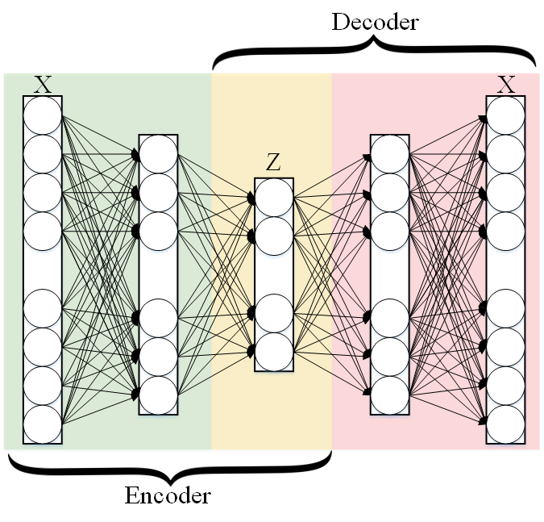

.. code:: python

  from keras.layers import Input, Dense
  from keras.models import Model

  # this is the size of our encoded representations
  encoding_dim = 1500  

  # this is our input placeholder
  input = Input(shape=(n,))
  # "encoded" is the encoded representation of the input
  encoded = Dense(encoding_dim, activation='relu')(input)
  # "decoded" is the lossy reconstruction of the input
  decoded = Dense(n, activation='sigmoid')(encoded)

  # this model maps an input to its reconstruction
  autoencoder = Model(input, decoded)

  # this model maps an input to its encoded representation
  encoder = Model(input, encoded)
  

  encoded_input = Input(shape=(encoding_dim,))
  # retrieve the last layer of the autoencoder model
  decoder_layer = autoencoder.layers[-1]
  # create the decoder model
  decoder = Model(encoded_input, decoder_layer(encoded_input))
  
  autoencoder.compile(optimizer='adadelta', loss='binary_crossentropy')
  
  

Load data:

.. code:: python

  autoencoder.fit(x_train, x_train,
                  epochs=50,
                  batch_size=256,
                  shuffle=True,
                  validation_data=(x_test, x_test))
                  

~~~~~~~~~~~~~~~~~~~~~~~~~~~~~~~~~~~~~~~~~~~~~~~~~~~
T-distributed Stochastic Neighbor Embedding (T-SNE)
~~~~~~~~~~~~~~~~~~~~~~~~~~~~~~~~~~~~~~~~~~~~~~~~~~~

T-distributed Stochastic Neighbor Embedding (T-SNE) is a nonlinear dimensionality reduction technique for embedding high-dimensional data which is mostly used for visualization in a low-dimensional space. This approach is based on `G. Hinton and ST. Roweis <https://www.cs.toronto.edu/~fritz/absps/sne.pdf>`__ . SNE works by converting the high dimensional Euclidean distances into conditional probabilities which represent similarities.

 `Example <http://scikit-learn.org/stable/modules/generated/sklearn.manifold.TSNE.html>`__:

.. code:: python

   import numpy as np
   from sklearn.manifold import TSNE
   X = np.array([[0, 0, 0], [0, 1, 1], [1, 0, 1], [1, 1, 1]])
   X_embedded = TSNE(n_components=2).fit_transform(X)
   X_embedded.shape

Example of Glove and T-SNE for text:

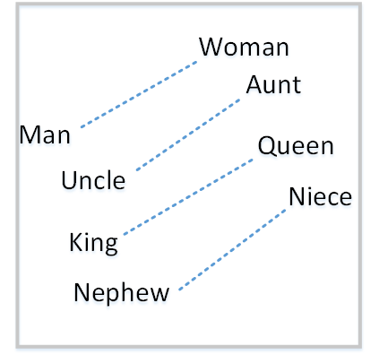

===============================
Text Classification Techniques
===============================

----

~~~~~~~~~~~~~~~~~~~~~~~~~~~~~~~~~~
Rocchio classification
~~~~~~~~~~~~~~~~~~~~~~~~~~~~~~~~~~

The first version of Rocchio algorithm is introduced by rocchio in 1971 to use relevance feedback in querying full-text databases. Since then many researchers have addressed and developed this technique for text and document classification. This method uses TF-IDF weights for each informative word instead of a set of Boolean features. Using a training set of documents, Rocchio's algorithm builds a prototype vector for each class which is an average vector over all training document vectors that belongs to a certain class. Then, it will assign each test document to a class with maximum similarity that between test document and each of the prototype vectors.

When in nearest centroid classifier, we used for text as input data for classification with tf-idf vectors, this classifier is known as the Rocchio classifier.

.. code:: python

    from sklearn.neighbors.nearest_centroid import NearestCentroid
    from sklearn.pipeline import Pipeline
    from sklearn import metrics
    from sklearn.feature_extraction.text import CountVectorizer
    from sklearn.feature_extraction.text import TfidfTransformer
    from sklearn.datasets import fetch_20newsgroups

    newsgroups_train = fetch_20newsgroups(subset='train')
    newsgroups_test = fetch_20newsgroups(subset='test')
    X_train = newsgroups_train.data
    X_test = newsgroups_test.data
    y_train = newsgroups_train.target
    y_test = newsgroups_test.target

    text_clf = Pipeline([('vect', CountVectorizer()),
                         ('tfidf', TfidfTransformer()),
                         ('clf', NearestCentroid()),
                         ])

    text_clf.fit(X_train, y_train)

    predicted = text_clf.predict(X_test)

    print(metrics.classification_report(y_test, predicted))

Output:

.. code:: python

                  precision    recall  f1-score   support

              0       0.75      0.49      0.60       319
              1       0.44      0.76      0.56       389
              2       0.75      0.68      0.71       394
              3       0.71      0.59      0.65       392
              4       0.81      0.71      0.76       385
              5       0.83      0.66      0.74       395
              6       0.49      0.88      0.63       390
              7       0.86      0.76      0.80       396
              8       0.91      0.86      0.89       398
              9       0.85      0.79      0.82       397
             10       0.95      0.80      0.87       399
             11       0.94      0.66      0.78       396
             12       0.40      0.70      0.51       393
             13       0.84      0.49      0.62       396
             14       0.89      0.72      0.80       394
             15       0.55      0.73      0.63       398
             16       0.68      0.76      0.71       364
             17       0.97      0.70      0.81       376
             18       0.54      0.53      0.53       310
             19       0.58      0.39      0.47       251

    avg / total       0.74      0.69      0.70      7532

~~~~~~~~~~~~~~~~~~~~~~~~~~~~~~~~~~
Boosting and Bagging
~~~~~~~~~~~~~~~~~~~~~~~~~~~~~~~~~~

---------
Boosting
---------

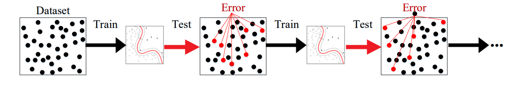

**Boosting** is a Ensemble learning meta-algorithm for primarily reducing variance in supervised learning. It is basically a family of machine learning algorithms that convert weak learners to strong ones. Boosting is based on the question posed by `Michael Kearns <https://en.wikipedia.org/wiki/Michael_Kearns_(computer_scientist)>`__  and Leslie Valiant (1988, 1989) Can a set of weak learners create a single strong learner? A weak learner is defined to be a Classification that is only slightly correlated with the true classification (it can label examples better than random guessing). In contrast, a strong learner is a classifier that is arbitrarily well-correlated with the true classification.

.. code:: python

  from sklearn.ensemble import GradientBoostingClassifier
  from sklearn.pipeline import Pipeline
  from sklearn import metrics
  from sklearn.feature_extraction.text import CountVectorizer
  from sklearn.feature_extraction.text import TfidfTransformer
  from sklearn.datasets import fetch_20newsgroups

  newsgroups_train = fetch_20newsgroups(subset='train')
  newsgroups_test = fetch_20newsgroups(subset='test')
  X_train = newsgroups_train.data
  X_test = newsgroups_test.data
  y_train = newsgroups_train.target
  y_test = newsgroups_test.target

  text_clf = Pipeline([('vect', CountVectorizer()),
                       ('tfidf', TfidfTransformer()),
                       ('clf', GradientBoostingClassifier(n_estimators=100)),
                       ])

  text_clf.fit(X_train, y_train)

  predicted = text_clf.predict(X_test)

  print(metrics.classification_report(y_test, predicted))

Output:
 
.. code:: python

               precision    recall  f1-score   support
            0       0.81      0.66      0.73       319
            1       0.69      0.70      0.69       389
            2       0.70      0.68      0.69       394
            3       0.64      0.72      0.68       392
            4       0.79      0.79      0.79       385
            5       0.83      0.64      0.72       395
            6       0.81      0.84      0.82       390
            7       0.84      0.75      0.79       396
            8       0.90      0.86      0.88       398
            9       0.90      0.85      0.88       397
           10       0.93      0.86      0.90       399
           11       0.90      0.81      0.85       396
           12       0.33      0.69      0.45       393
           13       0.87      0.72      0.79       396
           14       0.87      0.84      0.85       394
           15       0.85      0.87      0.86       398
           16       0.65      0.78      0.71       364
           17       0.96      0.74      0.84       376
           18       0.70      0.55      0.62       310
           19       0.62      0.56      0.59       251

  avg / total       0.78      0.75      0.76      7532

  
-------
Bagging
-------

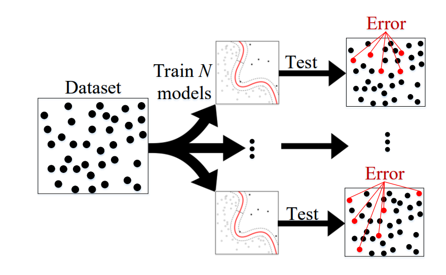

.. code:: python

    from sklearn.ensemble import BaggingClassifier
    from sklearn.neighbors import KNeighborsClassifier
    from sklearn.pipeline import Pipeline
    from sklearn import metrics
    from sklearn.feature_extraction.text import CountVectorizer
    from sklearn.feature_extraction.text import TfidfTransformer
    from sklearn.datasets import fetch_20newsgroups

    newsgroups_train = fetch_20newsgroups(subset='train')
    newsgroups_test = fetch_20newsgroups(subset='test')
    X_train = newsgroups_train.data
    X_test = newsgroups_test.data
    y_train = newsgroups_train.target
    y_test = newsgroups_test.target

    text_clf = Pipeline([('vect', CountVectorizer()),
                         ('tfidf', TfidfTransformer()),
                         ('clf', BaggingClassifier(KNeighborsClassifier())),
                         ])

    text_clf.fit(X_train, y_train)

    predicted = text_clf.predict(X_test)

    print(metrics.classification_report(y_test, predicted))

Output:
 
.. code:: python

               precision    recall  f1-score   support
            0       0.57      0.74      0.65       319
            1       0.60      0.56      0.58       389
            2       0.62      0.54      0.58       394
            3       0.54      0.57      0.55       392
            4       0.63      0.54      0.58       385
            5       0.68      0.62      0.65       395
            6       0.55      0.46      0.50       390
            7       0.77      0.67      0.72       396
            8       0.79      0.82      0.80       398
            9       0.74      0.77      0.76       397
           10       0.81      0.86      0.83       399
           11       0.74      0.85      0.79       396
           12       0.67      0.49      0.57       393
           13       0.78      0.51      0.62       396
           14       0.76      0.78      0.77       394
           15       0.71      0.81      0.76       398
           16       0.73      0.73      0.73       364
           17       0.64      0.79      0.71       376
           18       0.45      0.69      0.54       310
           19       0.61      0.54      0.57       251

  avg / total       0.67      0.67      0.67      7532
  

~~~~~~~~~~~~~~~~~~~~~~~~~~~~~~~~~~
Naive Bayes Classifier
~~~~~~~~~~~~~~~~~~~~~~~~~~~~~~~~~~

Naïve Bayes text classification has been used in industry
and academia for a long time (introduced by Thomas Bayes
between 1701-1761). However, this technique
is being studied since the 1950s for text and document categorization. Naive Bayes Classifier (NBC) is generative
model which is widely used in Information Retrieval. Many researchers addressed and developed this technique
for their applications. We start with the most basic version
of NBC which developed by using term-frequency (Bag of
Word) fetaure extraction technique by counting number of
words in documents

.. code:: python

    from sklearn.naive_bayes import MultinomialNB
    from sklearn.pipeline import Pipeline
    from sklearn import metrics
    from sklearn.feature_extraction.text import CountVectorizer
    from sklearn.feature_extraction.text import TfidfTransformer
    from sklearn.datasets import fetch_20newsgroups

    newsgroups_train = fetch_20newsgroups(subset='train')
    newsgroups_test = fetch_20newsgroups(subset='test')
    X_train = newsgroups_train.data
    X_test = newsgroups_test.data
    y_train = newsgroups_train.target
    y_test = newsgroups_test.target

    text_clf = Pipeline([('vect', CountVectorizer()),
                         ('tfidf', TfidfTransformer()),
                         ('clf', MultinomialNB()),
                         ])

    text_clf.fit(X_train, y_train)

    predicted = text_clf.predict(X_test)

    print(metrics.classification_report(y_test, predicted))
 
 
Output:
 
.. code:: python

                   precision    recall  f1-score   support

              0       0.80      0.52      0.63       319
              1       0.81      0.65      0.72       389
              2       0.82      0.65      0.73       394
              3       0.67      0.78      0.72       392
              4       0.86      0.77      0.81       385
              5       0.89      0.75      0.82       395
              6       0.93      0.69      0.80       390
              7       0.85      0.92      0.88       396
              8       0.94      0.93      0.93       398
              9       0.92      0.90      0.91       397
             10       0.89      0.97      0.93       399
             11       0.59      0.97      0.74       396
             12       0.84      0.60      0.70       393
             13       0.92      0.74      0.82       396
             14       0.84      0.89      0.87       394
             15       0.44      0.98      0.61       398
             16       0.64      0.94      0.76       364
             17       0.93      0.91      0.92       376
             18       0.96      0.42      0.58       310
             19       0.97      0.14      0.24       251

    avg / total       0.82      0.77      0.77      7532

~~~~~~~~~~~~~~~~~~~~~~~~~~~~~~~~~~
K-nearest Neighbor
~~~~~~~~~~~~~~~~~~~~~~~~~~~~~~~~~~
R
In machine learning, the k-nearest neighbors algorithm (kNN)
is a non-parametric technique used for classification.
This method is used in Natural-language processing (NLP)
as a text classification technique in many researches in the past
decades.

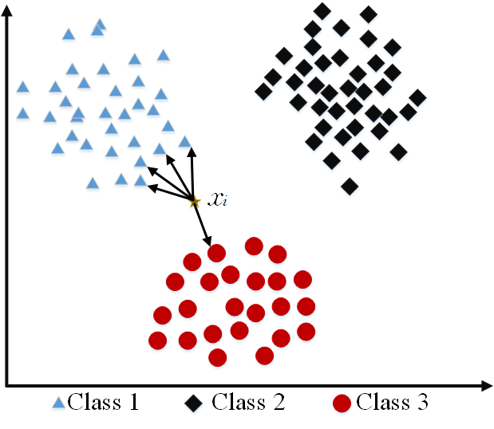

.. code:: python

    from sklearn.neighbors import KNeighborsClassifier
    from sklearn.pipeline import Pipeline
    from sklearn import metrics
    from sklearn.feature_extraction.text import CountVectorizer
    from sklearn.feature_extraction.text import TfidfTransformer
    from sklearn.datasets import fetch_20newsgroups

    newsgroups_train = fetch_20newsgroups(subset='train')
    newsgroups_test = fetch_20newsgroups(subset='test')
    X_train = newsgroups_train.data
    X_test = newsgroups_test.data
    y_train = newsgroups_train.target
    y_test = newsgroups_test.target

    text_clf = Pipeline([('vect', CountVectorizer()),
                         ('tfidf', TfidfTransformer()),
                         ('clf', KNeighborsClassifier()),
                         ])

    text_clf.fit(X_train, y_train)

    predicted = text_clf.predict(X_test)

    print(metrics.classification_report(y_test, predicted))

Output:

.. code:: python

                   precision    recall  f1-score   support

              0       0.43      0.76      0.55       319
              1       0.50      0.61      0.55       389
              2       0.56      0.57      0.57       394
              3       0.53      0.58      0.56       392
              4       0.59      0.56      0.57       385
              5       0.69      0.60      0.64       395
              6       0.58      0.45      0.51       390
              7       0.75      0.69      0.72       396
              8       0.84      0.81      0.82       398
              9       0.77      0.72      0.74       397
             10       0.85      0.84      0.84       399
             11       0.76      0.84      0.80       396
             12       0.70      0.50      0.58       393
             13       0.82      0.49      0.62       396
             14       0.79      0.76      0.78       394
             15       0.75      0.76      0.76       398
             16       0.70      0.73      0.72       364
             17       0.62      0.76      0.69       376
             18       0.55      0.61      0.58       310
             19       0.56      0.49      0.52       251

    avg / total       0.67      0.66      0.66      7532

~~~~~~~~~~~~~~~~~~~~~~~~~~~~~~~~~~
Support Vector Machine (SVM)
~~~~~~~~~~~~~~~~~~~~~~~~~~~~~~~~~~

The original version of SVM was introduced by Vapnik and  Chervonenkis in 1963. The early 1990s, nonlinear version was addressed by BE. Boser et al.. Original version of SVM was designed for binary classification problem, but Many researchers have worked on multi-class problem using this authoritative technique.

The advantages of support vector machines are based on scikit-learn page:

* Effective in high dimensional spaces.
* Still effective in cases where number of dimensions is greater than the number of samples.
* Uses a subset of training points in the decision function (called support vectors), so it is also memory efficient.
* Versatile: different Kernel functions can be specified for the decision function. Common kernels are provided, but it is also possible to specify custom kernels.

The disadvantages of support vector machines include:

* If the number of features is much greater than the number of samples, avoiding over-fitting via choosing kernel functions and regularization term is crucial.
* SVMs do not directly provide probability estimates, these are calculated using an expensive five-fold cross-validation (see Scores and probabilities, below).

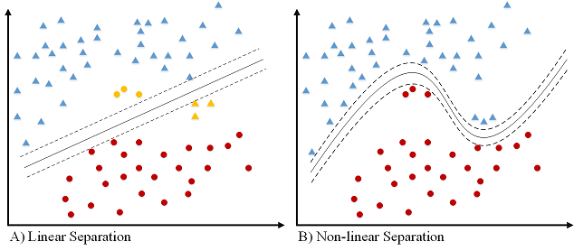

.. code:: python

    from sklearn.svm import LinearSVC
    from sklearn.pipeline import Pipeline
    from sklearn import metrics
    from sklearn.feature_extraction.text import CountVectorizer
    from sklearn.feature_extraction.text import TfidfTransformer
    from sklearn.datasets import fetch_20newsgroups

    newsgroups_train = fetch_20newsgroups(subset='train')
    newsgroups_test = fetch_20newsgroups(subset='test')
    X_train = newsgroups_train.data
    X_test = newsgroups_test.data
    y_train = newsgroups_train.target
    y_test = newsgroups_test.target

    text_clf = Pipeline([('vect', CountVectorizer()),
                         ('tfidf', TfidfTransformer()),
                         ('clf', LinearSVC()),
                         ])

    text_clf.fit(X_train, y_train)

    predicted = text_clf.predict(X_test)

    print(metrics.classification_report(y_test, predicted))

output:

.. code:: python

                   precision    recall  f1-score   support

              0       0.82      0.80      0.81       319
              1       0.76      0.80      0.78       389
              2       0.77      0.73      0.75       394
              3       0.71      0.76      0.74       392
              4       0.84      0.86      0.85       385
              5       0.87      0.76      0.81       395
              6       0.83      0.91      0.87       390
              7       0.92      0.91      0.91       396
              8       0.95      0.95      0.95       398
              9       0.92      0.95      0.93       397
             10       0.96      0.98      0.97       399
             11       0.93      0.94      0.93       396
             12       0.81      0.79      0.80       393
             13       0.90      0.87      0.88       396
             14       0.90      0.93      0.92       394
             15       0.84      0.93      0.88       398
             16       0.75      0.92      0.82       364
             17       0.97      0.89      0.93       376
             18       0.82      0.62      0.71       310
             19       0.75      0.61      0.68       251

    avg / total       0.85      0.85      0.85      7532

~~~~~~~~~~~~~~~~~~~~~~~~~~~~~~~~~~
Decision Tree
~~~~~~~~~~~~~~~~~~~~~~~~~~~~~~~~~~

One of earlier classification algorithm for text and data mining is decision tree. Decision tree classifiers (DTC's) are used successfully in many diverse areas of classification. The structure of this technique includes a hierarchical decomposition of the data space (only train dataset). Decision tree as classification task was introduced by `D. Morgan <http://www.aclweb.org/anthology/P95-1037>`__ and developed by `JR. Quinlan <https://courses.cs.ut.ee/2009/bayesian-networks/extras/quinlan1986.pdf>`__. The main idea is creating trees based on the attributes of the data points, but the challenge is determining which attribute should be in parent level and which one should be in child level. To solve this problem, `De Mantaras <https://link.springer.com/article/10.1023/A:1022694001379>`__ introduced statistical modeling for feature selection in tree.

.. code:: python

    from sklearn import tree
    from sklearn.pipeline import Pipeline
    from sklearn import metrics
    from sklearn.feature_extraction.text import CountVectorizer
    from sklearn.feature_extraction.text import TfidfTransformer
    from sklearn.datasets import fetch_20newsgroups

    newsgroups_train = fetch_20newsgroups(subset='train')
    newsgroups_test = fetch_20newsgroups(subset='test')
    X_train = newsgroups_train.data
    X_test = newsgroups_test.data
    y_train = newsgroups_train.target
    y_test = newsgroups_test.target

    text_clf = Pipeline([('vect', CountVectorizer()),
                         ('tfidf', TfidfTransformer()),
                         ('clf', tree.DecisionTreeClassifier()),
                         ])

    text_clf.fit(X_train, y_train)

    predicted = text_clf.predict(X_test)

    print(metrics.classification_report(y_test, predicted))

output:

.. code:: python

                   precision    recall  f1-score   support

              0       0.51      0.48      0.49       319
              1       0.42      0.42      0.42       389
              2       0.51      0.56      0.53       394
              3       0.46      0.42      0.44       392
              4       0.50      0.56      0.53       385
              5       0.50      0.47      0.48       395
              6       0.66      0.73      0.69       390
              7       0.60      0.59      0.59       396
              8       0.66      0.72      0.69       398
              9       0.53      0.55      0.54       397
             10       0.68      0.66      0.67       399
             11       0.73      0.69      0.71       396
             12       0.34      0.33      0.33       393
             13       0.52      0.42      0.46       396
             14       0.65      0.62      0.63       394
             15       0.68      0.72      0.70       398
             16       0.49      0.62      0.55       364
             17       0.78      0.60      0.68       376
             18       0.38      0.38      0.38       310
             19       0.32      0.32      0.32       251

    avg / total       0.55      0.55      0.55      7532

~~~~~~~~~~~~~~~~~~~~~~~~~~~~~~~~~~
Random Forest
~~~~~~~~~~~~~~~~~~~~~~~~~~~~~~~~~~

Random forests or random decision forests technique is an ensemble learning method for text classification. This method was introduced by `T. Kam Ho <https://doi.org/10.1109/ICDAR.1995.598994>`__ in 1995 for first time which used t trees in parallel. This technique was later developed by `L. Breiman <https://link.springer.com/article/10.1023/A:1010933404324>`__ in 1999 that they found converged for RF as a margin measure.

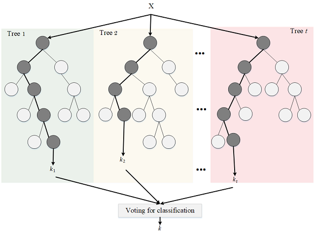

.. code:: python

    from sklearn.ensemble import RandomForestClassifier
    from sklearn.pipeline import Pipeline
    from sklearn import metrics
    from sklearn.feature_extraction.text import CountVectorizer
    from sklearn.feature_extraction.text import TfidfTransformer
    from sklearn.datasets import fetch_20newsgroups

    newsgroups_train = fetch_20newsgroups(subset='train')
    newsgroups_test = fetch_20newsgroups(subset='test')
    X_train = newsgroups_train.data
    X_test = newsgroups_test.data
    y_train = newsgroups_train.target
    y_test = newsgroups_test.target

    text_clf = Pipeline([('vect', CountVectorizer()),
                         ('tfidf', TfidfTransformer()),
                         ('clf', RandomForestClassifier(n_estimators=100)),
                         ])

    text_clf.fit(X_train, y_train)

    predicted = text_clf.predict(X_test)

    print(metrics.classification_report(y_test, predicted))

output:

.. code:: python

                    precision    recall  f1-score   support

              0       0.69      0.63      0.66       319
              1       0.56      0.69      0.62       389
              2       0.67      0.78      0.72       394
              3       0.67      0.67      0.67       392
              4       0.71      0.78      0.74       385
              5       0.78      0.68      0.73       395
              6       0.74      0.92      0.82       390
              7       0.81      0.79      0.80       396
              8       0.90      0.89      0.90       398
              9       0.80      0.89      0.84       397
             10       0.90      0.93      0.91       399
             11       0.89      0.91      0.90       396
             12       0.68      0.49      0.57       393
             13       0.83      0.65      0.73       396
             14       0.81      0.88      0.84       394
             15       0.68      0.91      0.78       398
             16       0.67      0.86      0.75       364
             17       0.93      0.78      0.85       376
             18       0.86      0.48      0.61       310
             19       0.79      0.31      0.45       251

    avg / total       0.77      0.76      0.75      7532

~~~~~~~~~~~~~~~~~~~~~~~~~~~~~~~~~~
Conditional Random Field (CRF)
~~~~~~~~~~~~~~~~~~~~~~~~~~~~~~~~~~

Conditional Random Field (CRF) is an undirected graphical model as shown in figure. CRFs state the conditional probability of a label sequence *Y* give a sequence of observation *X* *i.e.* P(Y|X). CRFs can incorporate complex features of observation sequence without violating the independence assumption by modeling the conditional probability of the label sequences rather than the joint probability P(X,Y). The concept of clique which is a fully connected subgraph and clique potential are used for computing P(X|Y). Considering one potential function for each clique of the graph, the probability of a variable configuration corresponds to the product of a series of non-negative potential function. The value computed by each potential function is equivalent to the probability of the variables in its corresponding clique taken on a particular configuration.

.. image:: docs/pic/CRF.png

Example from `Here <http://sklearn-crfsuite.readthedocs.io/en/latest/tutorial.html>`__
Let’s use CoNLL 2002 data to build a NER system
CoNLL2002 corpus is available in NLTK. We use Spanish data.

.. code:: python

      import nltk
      import sklearn_crfsuite
      from sklearn_crfsuite import metrics
      nltk.corpus.conll2002.fileids()
      train_sents = list(nltk.corpus.conll2002.iob_sents('esp.train'))
      test_sents = list(nltk.corpus.conll2002.iob_sents('esp.testb'))
      
      
sklearn-crfsuite (and python-crfsuite) supports several feature formats; here we use feature dicts.

.. code:: python

      def word2features(sent, i):
          word = sent[i][0]
          postag = sent[i][1]

          features = {
              'bias': 1.0,
              'word.lower()': word.lower(),
              'word[-3:]': word[-3:],
              'word[-2:]': word[-2:],
              'word.isupper()': word.isupper(),
              'word.istitle()': word.istitle(),
              'word.isdigit()': word.isdigit(),
              'postag': postag,
              'postag[:2]': postag[:2],
          }
          if i > 0:
              word1 = sent[i-1][0]
              postag1 = sent[i-1][1]
              features.update({
                  '-1:word.lower()': word1.lower(),
                  '-1:word.istitle()': word1.istitle(),
                  '-1:word.isupper()': word1.isupper(),
                  '-1:postag': postag1,
                  '-1:postag[:2]': postag1[:2],
              })
          else:
              features['BOS'] = True

          if i < len(sent)-1:
              word1 = sent[i+1][0]
              postag1 = sent[i+1][1]
              features.update({
                  '+1:word.lower()': word1.lower(),
                  '+1:word.istitle()': word1.istitle(),
                  '+1:word.isupper()': word1.isupper(),
                  '+1:postag': postag1,
                  '+1:postag[:2]': postag1[:2],
              })
          else:
              features['EOS'] = True

          return features

      def sent2features(sent):
          return [word2features(sent, i) for i in range(len(sent))]

      def sent2labels(sent):
          return [label for token, postag, label in sent]

      def sent2tokens(sent):
          return [token for token, postag, label in sent]

      X_train = [sent2features(s) for s in train_sents]
      y_train = [sent2labels(s) for s in train_sents]

      X_test = [sent2features(s) for s in test_sents]
      y_test = [sent2labels(s) for s in test_sents]

To see all possible CRF parameters check its docstring. Here we are useing L-BFGS training algorithm (it is default) with Elastic Net (L1 + L2) regularization.

.. code:: python

      crf = sklearn_crfsuite.CRF(
          algorithm='lbfgs',
          c1=0.1,
          c2=0.1,
          max_iterations=100,
          all_possible_transitions=True
      )
      crf.fit(X_train, y_train)

Evaluation

.. code:: python

      y_pred = crf.predict(X_test)
      print(metrics.flat_classification_report(
          y_test, y_pred,  digits=3
      ))

Output:

.. code:: python

                     precision    recall  f1-score   support

            B-LOC      0.810     0.784     0.797      1084
           B-MISC      0.731     0.569     0.640       339
            B-ORG      0.807     0.832     0.820      1400
            B-PER      0.850     0.884     0.867       735
            I-LOC      0.690     0.637     0.662       325
           I-MISC      0.699     0.589     0.639       557
            I-ORG      0.852     0.786     0.818      1104
            I-PER      0.893     0.943     0.917       634
                O      0.992     0.997     0.994     45355

      avg / total      0.970     0.971     0.971     51533

~~~~~~~~~~~~~~~~~~~~~~~~~~~~~~~~~~
Deep Learning
~~~~~~~~~~~~~~~~~~~~~~~~~~~~~~~~~~

-----------------------------------------
Deep Neural Networks
-----------------------------------------

Deep Neural Networks architectures are designed to learn through multiple connection of layers where each single layer only receives connection from previous and provides connections only to the next layer in hidden part. The input is a connection of feature space (As discussed in Section Feature_extraction with first hidden layer. For Deep Neural Networks (DNN), input layer could be tf-ifd, word embedding, or etc. as shown in standard DNN in Figure. The output layer houses neurons equal to the number of classes for multi-class classification and only one neuron for binary classification. But our main contribution in this paper is that we have many trained DNNs to serve different purposes. Here, we have multi-class DNNs where each learning model is generated randomly (number of nodes in each layer as well as the number of layers are randomly assigned). Our implementation of Deep Neural Network (DNN) is basically a discriminatively trained model that uses standard back-propagation algorithm and sigmoid or ReLU as activation functions. The output layer for multi-class classification should use Softmax.

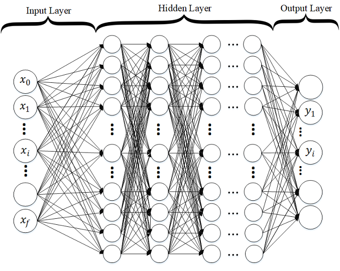

import packages:

.. code:: python

    from sklearn.datasets import fetch_20newsgroups
    from keras.layers import  Dropout, Dense
    from keras.models import Sequential
    from sklearn.feature_extraction.text import TfidfVectorizer
    import numpy as np
    from sklearn import metrics

convert text to TF-IDF:

.. code:: python

    def TFIDF(X_train, X_test,MAX_NB_WORDS=75000):
        vectorizer_x = TfidfVectorizer(max_features=MAX_NB_WORDS)
        X_train = vectorizer_x.fit_transform(X_train).toarray()
        X_test = vectorizer_x.transform(X_test).toarray()
        print("tf-idf with",str(np.array(X_train).shape[1]),"features")
        return (X_train,X_test)

Build a DNN Model for Text:

.. code:: python

    def Build_Model_DNN_Text(shape, nClasses, dropout=0.5):
        """
        buildModel_DNN_Tex(shape, nClasses,dropout)
        Build Deep neural networks Model for text classification
        Shape is input feature space
        nClasses is number of classes
        """
        model = Sequential()
        node = 512 # number of nodes
        nLayers = 4 # number of  hidden layer

        model.add(Dense(node,input_dim=shape,activation='relu'))
        model.add(Dropout(dropout))
        for i in range(0,nLayers):
            model.add(Dense(node,input_dim=node,activation='relu'))
            model.add(Dropout(dropout))
        model.add(Dense(nClasses, activation='softmax'))

        model.compile(loss='sparse_categorical_crossentropy',
                      optimizer='adam',
                      metrics=['accuracy'])

        return model

Load text dataset (20newsgroups):

.. code:: python

    newsgroups_train = fetch_20newsgroups(subset='train')
    newsgroups_test = fetch_20newsgroups(subset='test')
    X_train = newsgroups_train.data
    X_test = newsgroups_test.data
    y_train = newsgroups_train.target
    y_test = newsgroups_test.target

run DNN and see our result:

.. code:: python

    X_train_tfidf,X_test_tfidf = TFIDF(X_train,X_test)
    model_DNN = Build_Model_DNN_Text(X_train_tfidf.shape[1], 20)
    model_DNN.fit(X_train_tfidf, y_train,
                                  validation_data=(X_test_tfidf, y_test),
                                  epochs=10,
                                  batch_size=128,
                                  verbose=2)

    predicted = model_DNN.predict(X_test_tfidf)

    print(metrics.classification_report(y_test, predicted))

Model summary:

.. code:: python 

    _________________________________________________________________
    Layer (type)                 Output Shape              Param #   
    =================================================================
    dense_1 (Dense)              (None, 512)               38400512  
    _________________________________________________________________
    dropout_1 (Dropout)          (None, 512)               0         
    _________________________________________________________________
    dense_2 (Dense)              (None, 512)               262656    
    _________________________________________________________________
    dropout_2 (Dropout)          (None, 512)               0         
    _________________________________________________________________
    dense_3 (Dense)              (None, 512)               262656    
    _________________________________________________________________
    dropout_3 (Dropout)          (None, 512)               0         
    _________________________________________________________________
    dense_4 (Dense)              (None, 512)               262656    
    _________________________________________________________________
    dropout_4 (Dropout)          (None, 512)               0         
    _________________________________________________________________
    dense_5 (Dense)              (None, 512)               262656    
    _________________________________________________________________
    dropout_5 (Dropout)          (None, 512)               0         
    _________________________________________________________________
    dense_6 (Dense)              (None, 20)                10260     
    =================================================================
    Total params: 39,461,396
    Trainable params: 39,461,396
    Non-trainable params: 0
    _________________________________________________________________

Output:

.. code:: python 

        Train on 11314 samples, validate on 7532 samples
        Epoch 1/10
         - 16s - loss: 2.7553 - acc: 0.1090 - val_loss: 1.9330 - val_acc: 0.3184
        Epoch 2/10
         - 15s - loss: 1.5330 - acc: 0.4222 - val_loss: 1.1546 - val_acc: 0.6204
        Epoch 3/10
         - 15s - loss: 0.7438 - acc: 0.7257 - val_loss: 0.8405 - val_acc: 0.7499
        Epoch 4/10
         - 15s - loss: 0.2967 - acc: 0.9020 - val_loss: 0.9214 - val_acc: 0.7767
        Epoch 5/10
         - 15s - loss: 0.1557 - acc: 0.9543 - val_loss: 0.8965 - val_acc: 0.7917
        Epoch 6/10
         - 15s - loss: 0.1015 - acc: 0.9705 - val_loss: 0.9427 - val_acc: 0.7949
        Epoch 7/10
         - 15s - loss: 0.0595 - acc: 0.9835 - val_loss: 0.9893 - val_acc: 0.7995
        Epoch 8/10
         - 15s - loss: 0.0495 - acc: 0.9866 - val_loss: 0.9512 - val_acc: 0.8079
        Epoch 9/10
         - 15s - loss: 0.0437 - acc: 0.9867 - val_loss: 0.9690 - val_acc: 0.8117
        Epoch 10/10
         - 15s - loss: 0.0443 - acc: 0.9880 - val_loss: 1.0004 - val_acc: 0.8070

                       precision    recall  f1-score   support

                  0       0.76      0.78      0.77       319
                  1       0.67      0.80      0.73       389
                  2       0.82      0.63      0.71       394
                  3       0.76      0.69      0.72       392
                  4       0.65      0.86      0.74       385
                  5       0.84      0.75      0.79       395
                  6       0.82      0.87      0.84       390
                  7       0.86      0.90      0.88       396
                  8       0.95      0.91      0.93       398
                  9       0.91      0.92      0.92       397
                 10       0.98      0.92      0.95       399
                 11       0.96      0.85      0.90       396
                 12       0.71      0.69      0.70       393
                 13       0.95      0.70      0.81       396
                 14       0.86      0.91      0.88       394
                 15       0.85      0.90      0.87       398
                 16       0.79      0.84      0.81       364
                 17       0.99      0.77      0.87       376
                 18       0.58      0.75      0.65       310
                 19       0.52      0.60      0.55       251

        avg / total       0.82      0.81      0.81      7532

-----------------------------------------
Recurrent Neural Networks (RNN)
-----------------------------------------

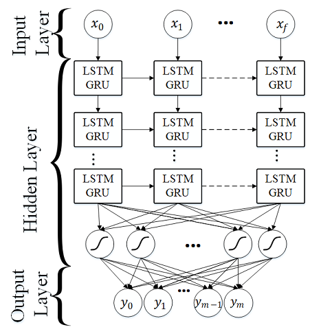

Another neural network architecture that is addressed by the researchers for text miming and classification is Recurrent Neural Networks (RNN). RNN assigns more weights to the previous data points of sequence. Therefore, this technique is a powerful method for text, string and sequential data classification. Moreover, this technique could be used for image classification as we did in this work. In RNN, the neural net considers the information of previous nodes in a very sophisticated method which allows for better semantic analysis of the structures in the dataset. 

Gated Recurrent Unit (GRU)
~~~~~~~~~~~~~~~~~~~~~~~~~~~~~

Gated Recurrent Unit (GRU) is a gating mechanism for RNN which was introduced by  `J. Chung et al. <https://arxiv.org/abs/1412.3555>`__ and `K.Cho et al. <https://arxiv.org/abs/1406.1078>`__. GRU is a simplified variant of the LSTM architecture, but there are differences as follows: GRU contains two gates and does not possess any internal memory (as shown in Figure; and finally, a second non-linearity is not applied (tanh in Figure).

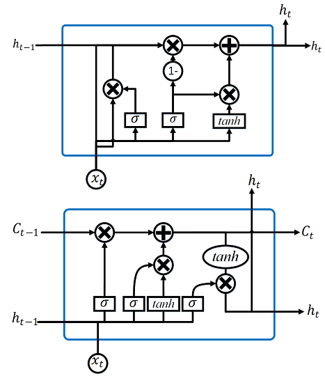

Long Short-Term Memory (LSTM)
~~~~~~~~~~~~~~~~~~~~~~~~~~~~~

Long Short-Term Memory~(LSTM) was introduced by `S. Hochreiter and J. Schmidhuber <https://www.mitpressjournals.org/doi/abs/10.1162/neco.1997.9.8.1735>`__  and developed by many research scientists.

To deal with these problems Long Short-Term Memory (LSTM) is a special type of RNN that preserves long term dependency in a more effective way compared to the basic RNNs. This is particularly useful to overcome vanishing gradient problem. Although LSTM has a chain-like structure similar to RNN, LSTM uses multiple gates to carefully regulate the amount of information that will be allowed into each node state. Figure shows the basic cell of a LSTM model.

import packages:

.. code:: python

    from keras.layers import Dropout, Dense, GRU, Embedding
    from keras.models import Sequential
    from sklearn.feature_extraction.text import TfidfVectorizer
    import numpy as np
    from sklearn import metrics
    from keras.preprocessing.text import Tokenizer
    from keras.preprocessing.sequence import pad_sequences
    from sklearn.datasets import fetch_20newsgroups

convert text to word embedding (Using GloVe):

.. code:: python

    def loadData_Tokenizer(X_train, X_test,MAX_NB_WORDS=75000,MAX_SEQUENCE_LENGTH=500):
        np.random.seed(7)
        text = np.concatenate((X_train, X_test), axis=0)
        text = np.array(text)
        tokenizer = Tokenizer(num_words=MAX_NB_WORDS)
        tokenizer.fit_on_texts(text)
        sequences = tokenizer.texts_to_sequences(text)
        word_index = tokenizer.word_index
        text = pad_sequences(sequences, maxlen=MAX_SEQUENCE_LENGTH)
        print('Found %s unique tokens.' % len(word_index))
        indices = np.arange(text.shape[0])
        # np.random.shuffle(indices)
        text = text[indices]
        print(text.shape)
        X_train = text[0:len(X_train), ]
        X_test = text[len(X_train):, ]
        embeddings_index = {}
        f = open("C:\\Users\\kamran\\Documents\\GitHub\\RMDL\\Examples\\Glove\\glove.6B.50d.txt", encoding="utf8")
        for line in f:

            values = line.split()
            word = values[0]
            try:
                coefs = np.asarray(values[1:], dtype='float32')
            except:
                pass
            embeddings_index[word] = coefs
        f.close()
        print('Total %s word vectors.' % len(embeddings_index))
        return (X_train, X_test, word_index,embeddings_index)

Build a RNN Model for Text:

.. code:: python

    def Build_Model_RNN_Text(word_index, embeddings_index, nclasses,  MAX_SEQUENCE_LENGTH=500, EMBEDDING_DIM=50, dropout=0.5):
        """
        def buildModel_RNN(word_index, embeddings_index, nclasses,  MAX_SEQUENCE_LENGTH=500, EMBEDDING_DIM=50, dropout=0.5):
        word_index in word index ,
        embeddings_index is embeddings index, look at data_helper.py
        nClasses is number of classes,
        MAX_SEQUENCE_LENGTH is maximum lenght of text sequences
        """

        model = Sequential()
        hidden_layer = 3
        gru_node = 32

        embedding_matrix = np.random.random((len(word_index) + 1, EMBEDDING_DIM))
        for word, i in word_index.items():
            embedding_vector = embeddings_index.get(word)
            if embedding_vector is not None:
                # words not found in embedding index will be all-zeros.
                if len(embedding_matrix[i]) != len(embedding_vector):
                    print("could not broadcast input array from shape", str(len(embedding_matrix[i])),
                          "into shape", str(len(embedding_vector)), " Please make sure your"
                                                                    " EMBEDDING_DIM is equal to embedding_vector file ,GloVe,")
                    exit(1)
                embedding_matrix[i] = embedding_vector
        model.add(Embedding(len(word_index) + 1,
                                    EMBEDDING_DIM,
                                    weights=[embedding_matrix],
                                    input_length=MAX_SEQUENCE_LENGTH,
                                    trainable=True))

        print(gru_node)
        for i in range(0,hidden_layer):
            model.add(GRU(gru_node,return_sequences=True, recurrent_dropout=0.2))
            model.add(Dropout(dropout))
        model.add(GRU(gru_node, recurrent_dropout=0.2))
        model.add(Dropout(dropout))
        model.add(Dense(256, activation='relu'))
        model.add(Dense(nclasses, activation='softmax'))

        model.compile(loss='sparse_categorical_crossentropy',
                          optimizer='adam',
                          metrics=['accuracy'])
        return model

run RNN and see our result:

.. code:: python

    newsgroups_train = fetch_20newsgroups(subset='train')
    newsgroups_test = fetch_20newsgroups(subset='test')
    X_train = newsgroups_train.data
    X_test = newsgroups_test.data
    y_train = newsgroups_train.target
    y_test = newsgroups_test.target

    X_train_Glove,X_test_Glove, word_index,embeddings_index = loadData_Tokenizer(X_train,X_test)

    model_RNN = Build_Model_RNN_Text(word_index,embeddings_index, 20)

    model_RNN.fit(X_train_Glove, y_train,
                                  validation_data=(X_test_Glove, y_test),
                                  epochs=10,
                                  batch_size=128,
                                  verbose=2)

    predicted = model_RNN.predict_classes(X_test_Glove)

    print(metrics.classification_report(y_test, predicted))

Model summary:

.. code:: python 

    _________________________________________________________________
    Layer (type)                 Output Shape              Param #   
    =================================================================
    embedding_1 (Embedding)      (None, 500, 50)           8960500   
    _________________________________________________________________
    gru_1 (GRU)                  (None, 500, 256)          235776    
    _________________________________________________________________
    dropout_1 (Dropout)          (None, 500, 256)          0         
    _________________________________________________________________
    gru_2 (GRU)                  (None, 500, 256)          393984    
    _________________________________________________________________
    dropout_2 (Dropout)          (None, 500, 256)          0         
    _________________________________________________________________
    gru_3 (GRU)                  (None, 500, 256)          393984    
    _________________________________________________________________
    dropout_3 (Dropout)          (None, 500, 256)          0         
    _________________________________________________________________
    gru_4 (GRU)                  (None, 256)               393984    
    _________________________________________________________________
    dense_1 (Dense)              (None, 20)                5140      
    =================================================================
    Total params: 10,383,368
    Trainable params: 10,383,368
    Non-trainable params: 0
    _________________________________________________________________

Output:

.. code:: python 

    Train on 11314 samples, validate on 7532 samples
    Epoch 1/20
     - 268s - loss: 2.5347 - acc: 0.1792 - val_loss: 2.2857 - val_acc: 0.2460
    Epoch 2/20
     - 271s - loss: 1.6751 - acc: 0.3999 - val_loss: 1.4972 - val_acc: 0.4660
    Epoch 3/20
     - 270s - loss: 1.0945 - acc: 0.6072 - val_loss: 1.3232 - val_acc: 0.5483
    Epoch 4/20
     - 269s - loss: 0.7761 - acc: 0.7312 - val_loss: 1.1009 - val_acc: 0.6452
    Epoch 5/20
     - 269s - loss: 0.5513 - acc: 0.8112 - val_loss: 1.0395 - val_acc: 0.6832
    Epoch 6/20
     - 269s - loss: 0.3765 - acc: 0.8754 - val_loss: 0.9977 - val_acc: 0.7086
    Epoch 7/20
     - 270s - loss: 0.2481 - acc: 0.9202 - val_loss: 1.0485 - val_acc: 0.7270
    Epoch 8/20
     - 269s - loss: 0.1717 - acc: 0.9463 - val_loss: 1.0269 - val_acc: 0.7394
    Epoch 9/20
     - 269s - loss: 0.1130 - acc: 0.9644 - val_loss: 1.1498 - val_acc: 0.7369
    Epoch 10/20
     - 269s - loss: 0.0640 - acc: 0.9808 - val_loss: 1.1442 - val_acc: 0.7508
    Epoch 11/20
     - 269s - loss: 0.0567 - acc: 0.9828 - val_loss: 1.2318 - val_acc: 0.7414
    Epoch 12/20
     - 268s - loss: 0.0472 - acc: 0.9858 - val_loss: 1.2204 - val_acc: 0.7496
    Epoch 13/20
     - 269s - loss: 0.0319 - acc: 0.9910 - val_loss: 1.1895 - val_acc: 0.7657
    Epoch 14/20
     - 268s - loss: 0.0466 - acc: 0.9853 - val_loss: 1.2821 - val_acc: 0.7517
    Epoch 15/20
     - 271s - loss: 0.0269 - acc: 0.9917 - val_loss: 1.2869 - val_acc: 0.7557
    Epoch 16/20
     - 271s - loss: 0.0187 - acc: 0.9950 - val_loss: 1.3037 - val_acc: 0.7598
    Epoch 17/20
     - 268s - loss: 0.0157 - acc: 0.9959 - val_loss: 1.2974 - val_acc: 0.7638
    Epoch 18/20
     - 270s - loss: 0.0121 - acc: 0.9966 - val_loss: 1.3526 - val_acc: 0.7602
    Epoch 19/20
     - 269s - loss: 0.0262 - acc: 0.9926 - val_loss: 1.4182 - val_acc: 0.7517
    Epoch 20/20
     - 269s - loss: 0.0249 - acc: 0.9918 - val_loss: 1.3453 - val_acc: 0.7638

                   precision    recall  f1-score   support

              0       0.71      0.71      0.71       319
              1       0.72      0.68      0.70       389
              2       0.76      0.62      0.69       394
              3       0.67      0.58      0.62       392
              4       0.68      0.67      0.68       385
              5       0.75      0.73      0.74       395
              6       0.82      0.74      0.78       390
              7       0.83      0.83      0.83       396
              8       0.81      0.90      0.86       398
              9       0.92      0.90      0.91       397
             10       0.91      0.94      0.93       399
             11       0.87      0.76      0.81       396
             12       0.57      0.70      0.63       393
             13       0.81      0.85      0.83       396
             14       0.74      0.93      0.82       394
             15       0.82      0.83      0.83       398
             16       0.74      0.78      0.76       364
             17       0.96      0.83      0.89       376
             18       0.64      0.60      0.62       310
             19       0.48      0.56      0.52       251

    avg / total       0.77      0.76      0.76      7532

-----------------------------------------
Convolutional Neural Networks (CNN)
-----------------------------------------

Another deep learning architecture that is employed for hierarchical document classification is  Convolutional Neural Networks (CNN) . Although originally built for image processing  with architecture similar to the visual cortex, CNNs have also been effectively used for text classification. In a basic CNN for image processing, an image tensor is convolved with a set of kernels of size *d by d*. These convolution layers are called feature maps and can be stacked to provide multiple filters on the input. To reduce the computational complexity, CNNs use pooling which reduces the size of the output from one layer to the next in the network. Different pooling techniques are used to reduce outputs while preserving important features.

The most common pooling method is max pooling where the maximum element is selected from the pooling window. In order to feed the pooled output from stacked featured maps to the next layer, the maps are flattened into one column. The final layers in a CNN are typically fully connected dense layers.
In general, during the back-propagation step of a convolutional neural network not only the weights are adjusted but also the feature detector filters. A potential problem of CNN used for text is the number of 'channels', *Sigma* (size of the feature space). This might be very large (e.g. 50K), for text but for images this is less of a problem (e.g. only 3 channels of RGB). This means the dimensionality of the CNN for text is very high.

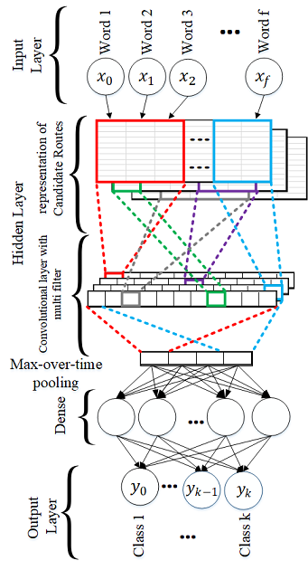

import packages:

.. code:: python

    from keras.layers import Dropout, Dense,Input,Embedding,Flatten, MaxPooling1D, Conv1D
    from keras.models import Sequential,Model
    from sklearn.feature_extraction.text import TfidfVectorizer
    import numpy as np
    from sklearn import metrics
    from keras.preprocessing.text import Tokenizer
    from keras.preprocessing.sequence import pad_sequences
    from sklearn.datasets import fetch_20newsgroups
    from keras.layers.merge import Concatenate

convert text to word embedding (Using GloVe):

.. code:: python

    def loadData_Tokenizer(X_train, X_test,MAX_NB_WORDS=75000,MAX_SEQUENCE_LENGTH=500):
        np.random.seed(7)
        text = np.concatenate((X_train, X_test), axis=0)
        text = np.array(text)
        tokenizer = Tokenizer(num_words=MAX_NB_WORDS)
        tokenizer.fit_on_texts(text)
        sequences = tokenizer.texts_to_sequences(text)
        word_index = tokenizer.word_index
        text = pad_sequences(sequences, maxlen=MAX_SEQUENCE_LENGTH)
        print('Found %s unique tokens.' % len(word_index))
        indices = np.arange(text.shape[0])
        # np.random.shuffle(indices)
        text = text[indices]
        print(text.shape)
        X_train = text[0:len(X_train), ]
        X_test = text[len(X_train):, ]
        embeddings_index = {}
        f = open("C:\\Users\\kamran\\Documents\\GitHub\\RMDL\\Examples\\Glove\\glove.6B.50d.txt", encoding="utf8")
        for line in f:
            values = line.split()
            word = values[0]
            try:
                coefs = np.asarray(values[1:], dtype='float32')
            except:
                pass
            embeddings_index[word] = coefs
        f.close()
        print('Total %s word vectors.' % len(embeddings_index))
        return (X_train, X_test, word_index,embeddings_index)

Build a CNN Model for Text:

.. code:: python

    def Build_Model_CNN_Text(word_index, embeddings_index, nclasses, MAX_SEQUENCE_LENGTH=500, EMBEDDING_DIM=50, dropout=0.5):

        """
            def buildModel_CNN(word_index, embeddings_index, nclasses, MAX_SEQUENCE_LENGTH=500, EMBEDDING_DIM=50, dropout=0.5):
            word_index in word index ,
            embeddings_index is embeddings index, look at data_helper.py
            nClasses is number of classes,
            MAX_SEQUENCE_LENGTH is maximum lenght of text sequences,
            EMBEDDING_DIM is an int value for dimention of word embedding look at data_helper.py
        """

        model = Sequential()
        embedding_matrix = np.random.random((len(word_index) + 1, EMBEDDING_DIM))
        for word, i in word_index.items():
            embedding_vector = embeddings_index.get(word)
            if embedding_vector is not None:
                # words not found in embedding index will be all-zeros.
                if len(embedding_matrix[i]) !=len(embedding_vector):
                    print("could not broadcast input array from shape",str(len(embedding_matrix[i])),
                                     "into shape",str(len(embedding_vector))," Please make sure your"
                                     " EMBEDDING_DIM is equal to embedding_vector file ,GloVe,")
                    exit(1)

                embedding_matrix[i] = embedding_vector

        embedding_layer = Embedding(len(word_index) + 1,
                                    EMBEDDING_DIM,
                                    weights=[embedding_matrix],
                                    input_length=MAX_SEQUENCE_LENGTH,
                                    trainable=True)

        # applying a more complex convolutional approach
        convs = []
        filter_sizes = []
        layer = 5
        print("Filter  ",layer)
        for fl in range(0,layer):
            filter_sizes.append((fl+2))

        node = 128
        sequence_input = Input(shape=(MAX_SEQUENCE_LENGTH,), dtype='int32')
        embedded_sequences = embedding_layer(sequence_input)

        for fsz in filter_sizes:
            l_conv = Conv1D(node, kernel_size=fsz, activation='relu')(embedded_sequences)
            l_pool = MaxPooling1D(5)(l_conv)
            #l_pool = Dropout(0.25)(l_pool)
            convs.append(l_pool)

        l_merge = Concatenate(axis=1)(convs)
        l_cov1 = Conv1D(node, 5, activation='relu')(l_merge)
        l_cov1 = Dropout(dropout)(l_cov1)
        l_pool1 = MaxPooling1D(5)(l_cov1)
        l_cov2 = Conv1D(node, 5, activation='relu')(l_pool1)
        l_cov2 = Dropout(dropout)(l_cov2)
        l_pool2 = MaxPooling1D(30)(l_cov2)
        l_flat = Flatten()(l_pool2)
        l_dense = Dense(1024, activation='relu')(l_flat)
        l_dense = Dropout(dropout)(l_dense)
        l_dense = Dense(512, activation='relu')(l_dense)
        l_dense = Dropout(dropout)(l_dense)
        preds = Dense(nclasses, activation='softmax')(l_dense)
        model = Model(sequence_input, preds)

        model.compile(loss='sparse_categorical_crossentropy',
                      optimizer='adam',
                      metrics=['accuracy'])

        return model

run CNN and see our result:

.. code:: python

    newsgroups_train = fetch_20newsgroups(subset='train')
    newsgroups_test = fetch_20newsgroups(subset='test')
    X_train = newsgroups_train.data
    X_test = newsgroups_test.data
    y_train = newsgroups_train.target
    y_test = newsgroups_test.target

    X_train_Glove,X_test_Glove, word_index,embeddings_index = loadData_Tokenizer(X_train,X_test)

    model_CNN = Build_Model_CNN_Text(word_index,embeddings_index, 20)

    model_CNN.summary()

    model_CNN.fit(X_train_Glove, y_train,
                                  validation_data=(X_test_Glove, y_test),
                                  epochs=15,
                                  batch_size=128,
                                  verbose=2)

    predicted = model_CNN.predict(X_test_Glove)

    predicted = np.argmax(predicted, axis=1)

    print(metrics.classification_report(y_test, predicted))

Model:

.. code:: python 

    __________________________________________________________________________________________________
    Layer (type)                    Output Shape         Param #     Connected to                     
    ==================================================================================================
    input_1 (InputLayer)            (None, 500)          0                                            
    __________________________________________________________________________________________________
    embedding_1 (Embedding)         (None, 500, 50)      8960500     input_1[0][0]                    
    __________________________________________________________________________________________________
    conv1d_1 (Conv1D)               (None, 499, 128)     12928       embedding_1[0][0]                
    __________________________________________________________________________________________________
    conv1d_2 (Conv1D)               (None, 498, 128)     19328       embedding_1[0][0]                
    __________________________________________________________________________________________________
    conv1d_3 (Conv1D)               (None, 497, 128)     25728       embedding_1[0][0]                
    __________________________________________________________________________________________________
    conv1d_4 (Conv1D)               (None, 496, 128)     32128       embedding_1[0][0]                
    __________________________________________________________________________________________________
    conv1d_5 (Conv1D)               (None, 495, 128)     38528       embedding_1[0][0]                
    __________________________________________________________________________________________________
    max_pooling1d_1 (MaxPooling1D)  (None, 99, 128)      0           conv1d_1[0][0]                   
    __________________________________________________________________________________________________
    max_pooling1d_2 (MaxPooling1D)  (None, 99, 128)      0           conv1d_2[0][0]                   
    __________________________________________________________________________________________________
    max_pooling1d_3 (MaxPooling1D)  (None, 99, 128)      0           conv1d_3[0][0]                   
    __________________________________________________________________________________________________
    max_pooling1d_4 (MaxPooling1D)  (None, 99, 128)      0           conv1d_4[0][0]                   
    __________________________________________________________________________________________________
    max_pooling1d_5 (MaxPooling1D)  (None, 99, 128)      0           conv1d_5[0][0]                   
    __________________________________________________________________________________________________
    concatenate_1 (Concatenate)     (None, 495, 128)     0           max_pooling1d_1[0][0]            
                                                                     max_pooling1d_2[0][0]            
                                                                     max_pooling1d_3[0][0]            
                                                                     max_pooling1d_4[0][0]            
                                                                     max_pooling1d_5[0][0]            
    __________________________________________________________________________________________________
    conv1d_6 (Conv1D)               (None, 491, 128)     82048       concatenate_1[0][0]              
    __________________________________________________________________________________________________
    dropout_1 (Dropout)             (None, 491, 128)     0           conv1d_6[0][0]                   
    __________________________________________________________________________________________________
    max_pooling1d_6 (MaxPooling1D)  (None, 98, 128)      0           dropout_1[0][0]                  
    __________________________________________________________________________________________________
    conv1d_7 (Conv1D)               (None, 94, 128)      82048       max_pooling1d_6[0][0]            
    __________________________________________________________________________________________________
    dropout_2 (Dropout)             (None, 94, 128)      0           conv1d_7[0][0]                   
    __________________________________________________________________________________________________
    max_pooling1d_7 (MaxPooling1D)  (None, 3, 128)       0           dropout_2[0][0]                  
    __________________________________________________________________________________________________
    flatten_1 (Flatten)             (None, 384)          0           max_pooling1d_7[0][0]            
    __________________________________________________________________________________________________
    dense_1 (Dense)                 (None, 1024)         394240      flatten_1[0][0]                  
    __________________________________________________________________________________________________
    dropout_3 (Dropout)             (None, 1024)         0           dense_1[0][0]                    
    __________________________________________________________________________________________________
    dense_2 (Dense)                 (None, 512)          524800      dropout_3[0][0]                  
    __________________________________________________________________________________________________
    dropout_4 (Dropout)             (None, 512)          0           dense_2[0][0]                    
    __________________________________________________________________________________________________
    dense_3 (Dense)                 (None, 20)           10260       dropout_4[0][0]                  
    ==================================================================================================
    Total params: 10,182,536
    Trainable params: 10,182,536
    Non-trainable params: 0
    __________________________________________________________________________________________________

Output:

.. code:: python 

    Train on 11314 samples, validate on 7532 samples
    Epoch 1/15
     - 6s - loss: 2.9329 - acc: 0.0783 - val_loss: 2.7628 - val_acc: 0.1403
    Epoch 2/15
     - 4s - loss: 2.2534 - acc: 0.2249 - val_loss: 2.1715 - val_acc: 0.4007
    Epoch 3/15
     - 4s - loss: 1.5643 - acc: 0.4326 - val_loss: 1.7846 - val_acc: 0.5052
    Epoch 4/15
     - 4s - loss: 1.1771 - acc: 0.5662 - val_loss: 1.4949 - val_acc: 0.6131
    Epoch 5/15
     - 4s - loss: 0.8880 - acc: 0.6797 - val_loss: 1.3629 - val_acc: 0.6256
    Epoch 6/15
     - 4s - loss: 0.6990 - acc: 0.7569 - val_loss: 1.2013 - val_acc: 0.6624
    Epoch 7/15
     - 4s - loss: 0.5037 - acc: 0.8200 - val_loss: 1.0674 - val_acc: 0.6807
    Epoch 8/15
     - 4s - loss: 0.4050 - acc: 0.8626 - val_loss: 1.0223 - val_acc: 0.6863
    Epoch 9/15
     - 4s - loss: 0.2952 - acc: 0.8968 - val_loss: 0.9045 - val_acc: 0.7120
    Epoch 10/15
     - 4s - loss: 0.2314 - acc: 0.9217 - val_loss: 0.8574 - val_acc: 0.7326
    Epoch 11/15
     - 4s - loss: 0.1778 - acc: 0.9436 - val_loss: 0.8752 - val_acc: 0.7270
    Epoch 12/15
     - 4s - loss: 0.1475 - acc: 0.9524 - val_loss: 0.8299 - val_acc: 0.7355
    Epoch 13/15
     - 4s - loss: 0.1089 - acc: 0.9657 - val_loss: 0.8034 - val_acc: 0.7491
    Epoch 14/15
     - 4s - loss: 0.1047 - acc: 0.9666 - val_loss: 0.8172 - val_acc: 0.7463
    Epoch 15/15
     - 4s - loss: 0.0749 - acc: 0.9774 - val_loss: 0.8511 - val_acc: 0.7313
     
     
                   precision    recall  f1-score   support

              0       0.75      0.61      0.67       319
              1       0.63      0.74      0.68       389
              2       0.74      0.54      0.62       394
              3       0.49      0.76      0.60       392
              4       0.60      0.70      0.64       385
              5       0.79      0.57      0.66       395
              6       0.73      0.76      0.74       390
              7       0.83      0.74      0.78       396
              8       0.86      0.88      0.87       398
              9       0.95      0.78      0.86       397
             10       0.93      0.93      0.93       399
             11       0.92      0.77      0.84       396
             12       0.55      0.72      0.62       393
             13       0.76      0.85      0.80       396
             14       0.86      0.83      0.84       394
             15       0.91      0.73      0.81       398
             16       0.75      0.65      0.70       364
             17       0.95      0.86      0.90       376
             18       0.60      0.49      0.54       310
             19       0.37      0.60      0.46       251

    avg / total       0.76      0.73      0.74      7532

-----------------------------------------
Hierarchical Attention Networks
-----------------------------------------

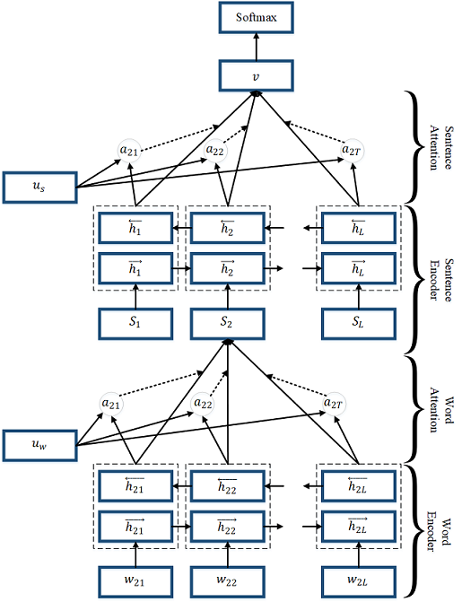

---------------------------------------------
Recurrent Convolutional Neural Networks (RCNN)
---------------------------------------------

Recurrent Convolutional Neural Networks (RCNN) is also used for text classification. The main idea of this technique is capturing contextual information with the recurrent structure and constructing the representation of text using a convolutional neural network. This architecture is a combination of RNN and CNN to use advantages of both technique in a model.

import packages:

.. code:: python 

      from keras.preprocessing import sequence
      from keras.models import Sequential
      from keras.layers import Dense, Dropout, Activation
      from keras.layers import Embedding
      from keras.layers import GRU
      from keras.layers import Conv1D, MaxPooling1D
      from keras.datasets import imdb
      from sklearn.datasets import fetch_20newsgroups
      import numpy as np
      from sklearn import metrics
      from keras.preprocessing.text import Tokenizer
      from keras.preprocessing.sequence import pad_sequences

Convert text to word embedding (Using GloVe):

.. code:: python 

      def loadData_Tokenizer(X_train, X_test,MAX_NB_WORDS=75000,MAX_SEQUENCE_LENGTH=500):
          np.random.seed(7)
          text = np.concatenate((X_train, X_test), axis=0)
          text = np.array(text)
          tokenizer = Tokenizer(num_words=MAX_NB_WORDS)
          tokenizer.fit_on_texts(text)
          sequences = tokenizer.texts_to_sequences(text)
          word_index = tokenizer.word_index
          text = pad_sequences(sequences, maxlen=MAX_SEQUENCE_LENGTH)
          print('Found %s unique tokens.' % len(word_index))
          indices = np.arange(text.shape[0])
          # np.random.shuffle(indices)
          text = text[indices]
          print(text.shape)
          X_train = text[0:len(X_train), ]
          X_test = text[len(X_train):, ]
          embeddings_index = {}
          f = open("C:\\Users\\kamran\\Documents\\GitHub\\RMDL\\Examples\\Glove\\glove.6B.50d.txt", encoding="utf8")
          for line in f:
              values = line.split()
              word = values[0]
              try:
                  coefs = np.asarray(values[1:], dtype='float32')
              except:
                  pass
              embeddings_index[word] = coefs
          f.close()
          print('Total %s word vectors.' % len(embeddings_index))
          return (X_train, X_test, word_index,embeddings_index)

.. code:: python 

      def Build_Model_RCNN_Text(word_index, embeddings_index, nclasses, MAX_SEQUENCE_LENGTH=500, EMBEDDING_DIM=50):

          kernel_size = 2
          filters = 256
          pool_size = 2
          gru_node = 256

          embedding_matrix = np.random.random((len(word_index) + 1, EMBEDDING_DIM))
          for word, i in word_index.items():
              embedding_vector = embeddings_index.get(word)
              if embedding_vector is not None:
                  # words not found in embedding index will be all-zeros.
                  if len(embedding_matrix[i]) !=len(embedding_vector):
                      print("could not broadcast input array from shape",str(len(embedding_matrix[i])),
                                       "into shape",str(len(embedding_vector))," Please make sure your"
                                       " EMBEDDING_DIM is equal to embedding_vector file ,GloVe,")
                      exit(1)

                  embedding_matrix[i] = embedding_vector

          model = Sequential()
          model.add(Embedding(len(word_index) + 1,
                                      EMBEDDING_DIM,
                                      weights=[embedding_matrix],
                                      input_length=MAX_SEQUENCE_LENGTH,
                                      trainable=True))
          model.add(Dropout(0.25))
          model.add(Conv1D(filters, kernel_size, activation='relu'))
          model.add(MaxPooling1D(pool_size=pool_size))
          model.add(Conv1D(filters, kernel_size, activation='relu'))
          model.add(MaxPooling1D(pool_size=pool_size))
          model.add(Conv1D(filters, kernel_size, activation='relu'))
          model.add(MaxPooling1D(pool_size=pool_size))
          model.add(Conv1D(filters, kernel_size, activation='relu'))
          model.add(MaxPooling1D(pool_size=pool_size))
          model.add(LSTM(gru_node, return_sequences=True, recurrent_dropout=0.2))
          model.add(LSTM(gru_node, return_sequences=True, recurrent_dropout=0.2))
          model.add(LSTM(gru_node, return_sequences=True, recurrent_dropout=0.2))
          model.add(LSTM(gru_node, recurrent_dropout=0.2))
          model.add(Dense(1024,activation='relu'))
          model.add(Dense(nclasses))
          model.add(Activation('softmax'))

          model.compile(loss='sparse_categorical_crossentropy',
                        optimizer='adam',
                        metrics=['accuracy'])

          return model

.. code:: python 

      newsgroups_train = fetch_20newsgroups(subset='train')
      newsgroups_test = fetch_20newsgroups(subset='test')
      X_train = newsgroups_train.data
      X_test = newsgroups_test.data
      y_train = newsgroups_train.target
      y_test = newsgroups_test.target

      X_train_Glove,X_test_Glove, word_index,embeddings_index = loadData_Tokenizer(X_train,X_test)

Run RCNN :

.. code:: python 

      model_RCNN = Build_Model_CNN_Text(word_index,embeddings_index, 20)

      model_RCNN.summary()

      model_RCNN.fit(X_train_Glove, y_train,
                                    validation_data=(X_test_Glove, y_test),
                                    epochs=15,
                                    batch_size=128,
                                    verbose=2)

      predicted = model_RCNN.predict(X_test_Glove)

      predicted = np.argmax(predicted, axis=1)
      print(metrics.classification_report(y_test, predicted))

summary of the model:

.. code:: python 

      _________________________________________________________________
      Layer (type)                 Output Shape              Param #   
      =================================================================
      embedding_1 (Embedding)      (None, 500, 50)           8960500   
      _________________________________________________________________
      dropout_1 (Dropout)          (None, 500, 50)           0         
      _________________________________________________________________
      conv1d_1 (Conv1D)            (None, 499, 256)          25856     
      _________________________________________________________________
      max_pooling1d_1 (MaxPooling1 (None, 249, 256)          0         
      _________________________________________________________________
      conv1d_2 (Conv1D)            (None, 248, 256)          131328    
      _________________________________________________________________
      max_pooling1d_2 (MaxPooling1 (None, 124, 256)          0         
      _________________________________________________________________
      conv1d_3 (Conv1D)            (None, 123, 256)          131328    
      _________________________________________________________________
      max_pooling1d_3 (MaxPooling1 (None, 61, 256)           0         
      _________________________________________________________________
      conv1d_4 (Conv1D)            (None, 60, 256)           131328    
      _________________________________________________________________
      max_pooling1d_4 (MaxPooling1 (None, 30, 256)           0         
      _________________________________________________________________
      lstm_1 (LSTM)                (None, 30, 256)           525312    
      _________________________________________________________________
      lstm_2 (LSTM)                (None, 30, 256)           525312    
      _________________________________________________________________
      lstm_3 (LSTM)                (None, 30, 256)           525312    
      _________________________________________________________________
      lstm_4 (LSTM)                (None, 256)               525312    
      _________________________________________________________________
      dense_1 (Dense)              (None, 1024)              263168    
      _________________________________________________________________
      dense_2 (Dense)              (None, 20)                20500     
      _________________________________________________________________
      activation_1 (Activation)    (None, 20)                0         
      =================================================================
      Total params: 11,765,256
      Trainable params: 11,765,256
      Non-trainable params: 0
      _________________________________________________________________

Output:

.. code:: python 

      Train on 11314 samples, validate on 7532 samples
      Epoch 1/15
       - 28s - loss: 2.6624 - acc: 0.1081 - val_loss: 2.3012 - val_acc: 0.1753
      Epoch 2/15
       - 22s - loss: 2.1142 - acc: 0.2224 - val_loss: 1.9168 - val_acc: 0.2669
      Epoch 3/15
       - 22s - loss: 1.7465 - acc: 0.3290 - val_loss: 1.8257 - val_acc: 0.3412
      Epoch 4/15
       - 22s - loss: 1.4730 - acc: 0.4356 - val_loss: 1.5433 - val_acc: 0.4436
      Epoch 5/15
       - 22s - loss: 1.1800 - acc: 0.5556 - val_loss: 1.2973 - val_acc: 0.5467
      Epoch 6/15
       - 22s - loss: 0.9910 - acc: 0.6281 - val_loss: 1.2530 - val_acc: 0.5797
      Epoch 7/15
       - 22s - loss: 0.8581 - acc: 0.6854 - val_loss: 1.1522 - val_acc: 0.6281
      Epoch 8/15
       - 22s - loss: 0.7058 - acc: 0.7428 - val_loss: 1.2385 - val_acc: 0.6033
      Epoch 9/15
       - 22s - loss: 0.6792 - acc: 0.7515 - val_loss: 1.0200 - val_acc: 0.6775
      Epoch 10/15
       - 22s - loss: 0.5782 - acc: 0.7948 - val_loss: 1.0961 - val_acc: 0.6577
      Epoch 11/15
       - 23s - loss: 0.4674 - acc: 0.8341 - val_loss: 1.0866 - val_acc: 0.6924
      Epoch 12/15
       - 23s - loss: 0.4284 - acc: 0.8512 - val_loss: 0.9880 - val_acc: 0.7096
      Epoch 13/15
       - 22s - loss: 0.3883 - acc: 0.8670 - val_loss: 1.0190 - val_acc: 0.7151
      Epoch 14/15
       - 22s - loss: 0.3334 - acc: 0.8874 - val_loss: 1.0025 - val_acc: 0.7232
      Epoch 15/15
       - 22s - loss: 0.2857 - acc: 0.9038 - val_loss: 1.0123 - val_acc: 0.7331

                   precision    recall  f1-score   support

                0       0.64      0.73      0.68       319
                1       0.45      0.83      0.58       389
                2       0.81      0.64      0.71       394
                3       0.64      0.57      0.61       392
                4       0.55      0.78      0.64       385
                5       0.77      0.52      0.62       395
                6       0.84      0.77      0.80       390
                7       0.87      0.79      0.83       396
                8       0.85      0.90      0.87       398
                9       0.98      0.84      0.90       397
               10       0.93      0.96      0.95       399
               11       0.92      0.79      0.85       396
               12       0.59      0.53      0.56       393
               13       0.82      0.82      0.82       396
               14       0.84      0.84      0.84       394
               15       0.83      0.89      0.86       398
               16       0.68      0.86      0.76       364
               17       0.97      0.86      0.91       376
               18       0.66      0.50      0.57       310
               19       0.53      0.31      0.40       251

      avg / total       0.77      0.75      0.75      7532

-----------------------------------------
Random Multimodel Deep Learning (RMDL)
-----------------------------------------

Referenced paper : `RMDL: Random Multimodel Deep Learning for
Classification <https://www.researchgate.net/publication/324922651_RMDL_Random_Multimodel_Deep_Learning_for_Classification>`__

A new ensemble, deep learning approach for classification. Deep
learning models have achieved state-of-the-art results across many domains.
RMDL solves the problem of finding the best deep learning structure
and architecture while simultaneously improving robustness and accuracy
through ensembles of different deep learning architectures. RDMLs can accept
a variety of data as input including text, video, images, and symbols.

|RMDL|

Random Multimodel Deep Learning (RDML) architecture for classification.
RMDL includes 3 Random models, oneDNN classifier at left, one Deep CNN
classifier at middle, and one Deep RNN classifier at right (each unit could be LSTMor GRU).

Installation

There are pip and git for RMDL installation:

Using pip

.. code:: python

        pip install RMDL

Using git

.. code:: bash

    git clone --recursive https://github.com/kk7nc/RMDL.git

The primary requirements for this package are Python 3 with Tensorflow. The requirements.txt file
contains a listing of the required Python packages; to install all requirements, run the following:

.. code:: bash

    pip -r install requirements.txt

Or

.. code:: bash

    pip3  install -r requirements.txt

Or:

.. code:: bash

    conda install --file requirements.txt

Documentation:

The exponential growth in the number of complex datasets every year requires  more enhancement in
machine learning methods to provide robust and accurate data classification. Lately, deep learning
approaches are achieving better results compared to previous machine learning algorithms
on tasks like image classification, natural language processing, face recognition, and etc. The
success of these deep learning algorithms rely on their capacity to model complex and non-linear
relationships within the data. However, finding suitable structures for these models has been a challenge
for researchers. This paper introduces Random Multimodel Deep Learning (RMDL): a new ensemble, deep learning
approach for classification. RMDL aims to solve the problem of finding the best deep learning architecture while simultaneously improving the robustness and accuracy through ensembles of multiple deep
learning architectures. In short, RMDL trains multiple models of Deep Neural Network (DNN),
Convolutional Neural Network (CNN) and Recurrent Neural Network (RNN) in parallel and combines
their results to produce better result of any of those models individually. To create these models,
each deep learning model has been constructed in a random fashion regarding the number of layers and
nodes in their neural network structure. The resulting RDML model can be used in various domains such
as text, video, images, and symbolic. In this Project, we describe RMDL model in depth and show the results
for image and text classification as well as face recognition. For image classification, we compared our
model with some of the available baselines using MNIST and CIFAR-10 datasets. Similarly, we used four
datasets namely, WOS, Reuters, IMDB, and 20newsgroup and compared our results with available baselines.
Web of Science (WOS) has been collected  by authors and consists of three sets~(small, medium and large set).
Lastly, we used ORL dataset to compare the performance of our approach with other face recognition methods.
These test results show that RDML model consistently outperform standard methods over a broad range of
data types and classification problems.

--------------------------------------------
Hierarchical Deep Learning for Text (HDLTex)
--------------------------------------------

Refrenced paper : `HDLTex: Hierarchical Deep Learning for Text
Classification <https://arxiv.org/abs/1709.08267>`__

|HDLTex|

Documentation:

Increasingly large document collections require improved information processing methods for searching, retrieving, and organizing  text documents. Central to these information processing methods is document classification, which has become an important task supervised learning aims to solve. Recently, the performance of traditional supervised classifiers has degraded as the number of documents has increased. This exponential growth of document volume has also increated the number of categories. This paper approaches this problem differently from current document classification methods that view the problem as multi-class classification. Instead we perform hierarchical classification using an approach we call Hierarchical Deep Learning for Text classification (HDLTex). HDLTex employs stacks of deep learning architectures to provide hierarchical understanding of the documents.

~~~~~~~~~~~~~~~~~~~~~~~~~~~~~~~~~~~~~~~~~~~~
Comparison Text Classification Algorithms
~~~~~~~~~~~~~~~~~~~~~~~~~~~~~~~~~~~~~~~~~~~~

+------------------------------------+----------------------------------------------------------------------------------------------------------------------------------------------------------+-----------------------------------------------------------------------------------------------------------------------------------------+
| **Model**                          | **Advantages**                                                                                                                                           | **Disadvantages**                                                                                                                       |
+------------------------------------+----------------------------------------------------------------------------------------------------------------------------------------------------------+-----------------------------------------------------------------------------------------------------------------------------------------+
| **Rocchio Algorithm**              |  * Easy to implement                                                                                                                                     |  * The user can only retrieve a few relevant documents                                                                                  |
|                                    |                                                                                                                                                          |                                                                                                                                         |
|                                    |  * Computationally is very cheap                                                                                                                         |  * Rocchio often misclassifies the type for multimodal class                                                                            |
|                                    |                                                                                                                                                          |                                                                                                                                         |
|                                    |  * Relevance feedback mechanism (benefits to ranking documents as  not relevant)                                                                         |  * This techniques is not very robust                                                                                                   |
|                                    |                                                                                                                                                          |                                                                                                                                         |
|                                    |                                                                                                                                                          |  * linear combination in this algorithm is not good for multi-class datasets                                                            |
+------------------------------------+----------------------------------------------------------------------------------------------------------------------------------------------------------+-----------------------------------------------------------------------------------------------------------------------------------------+
| **Boosting and Bagging**           |  * Improves the stability and accuracy (takes the advantage of ensemble learning where in multiple weak learner outperform a single strong learner.)     |  * Computational complexity                                                                                                             |
|                                    |                                                                                                                                                          |                                                                                                                                         |
|                                    |  * Reducing variance which helps to avoid overfitting problems.                                                                                          |  * loss of interpretability (if the number of models is hight, understanding the model is very difficult)                               |
|                                    |                                                                                                                                                          |                                                                                                                                         |
|                                    |                                                                                                                                                          |  * Requires careful tuning of different hyper-parameters.                                                                               |
+------------------------------------+----------------------------------------------------------------------------------------------------------------------------------------------------------+-----------------------------------------------------------------------------------------------------------------------------------------+
| **Logistic Regression**            |  * Easy to implement                                                                                                                                     |  * it cannot solve non-linear problems                                                                                                  |
|                                    |                                                                                                                                                          |                                                                                                                                         |
|                                    |  * does not require too many computational resources                                                                                                     |  * prediction requires that each data point be independent                                                                              |
|                                    |                                                                                                                                                          |                                                                                                                                         |
|                                    |  * it does not require input features to be scaled (pre-processing)                                                                                      |  * attempting to predict outcomes based on a set of independent variables                                                               |
|                                    |                                                                                                                                                          |                                                                                                                                         |
|                                    |  * It does not require any tuning                                                                                                                        |                                                                                                                                         |
+------------------------------------+----------------------------------------------------------------------------------------------------------------------------------------------------------+-----------------------------------------------------------------------------------------------------------------------------------------+
| **Naive Bayes Classifier**         |  * It works very well with text data                                                                                                                     |  *  A strong assumption about the shape of the data distribution                                                                        |
|                                    |                                                                                                                                                          |                                                                                                                                         |
|                                    |  * Easy to implement                                                                                                                                     |  * limited by data scarcity for which any possible value in feature space, a likelihood value must be estimated by a frequentist        |
|                                    |                                                                                                                                                          |                                                                                                                                         |
|                                    |  * Fast in comparing to other algorithms                                                                                                                 |                                                                                                                                         |
+------------------------------------+----------------------------------------------------------------------------------------------------------------------------------------------------------+-----------------------------------------------------------------------------------------------------------------------------------------+
| **K-Nearest Neighbor**             |  * Effective for text datasets                                                                                                                           |  * computational of this model is very expensive                                                                                        |
|                                    |                                                                                                                                                          |                                                                                                                                         |
|                                    |  * non-parametric                                                                                                                                        |  * diffcult to find optimal value of k                                                                                                  |
|                                    |                                                                                                                                                          |                                                                                                                                         |
|                                    |  * More local characteristics of text or document are considered                                                                                         |  * Constraint for large search problem to find nearest neighbors                                                                        |
|                                    |                                                                                                                                                          |                                                                                                                                         |
|                                    |  * Naturally handles multi-class datasets                                                                                                                |  * Finding a meaningful distance function is difficult for text datasets                                                                |
+------------------------------------+----------------------------------------------------------------------------------------------------------------------------------------------------------+-----------------------------------------------------------------------------------------------------------------------------------------+
| **Support Vector Machine (SVM)**   |  * SVM can model non-linear decision boundaries                                                                                                          |  * lack of transparency in results caused by a high number of dimensions (especially for text data).                                    |
|                                    |                                                                                                                                                          |                                                                                                                                         |
|                                    |  * Performs similarly to logistic regression when linear separation                                                                                      |  * Choosing an efficient kernel function is difficult (Susceptible to overfitting/training issues depending on kernel)                  |
|                                    |                                                                                                                                                          |                                                                                                                                         |
|                                    |  * Robust against overfitting problems~(especially for text dataset due to high-dimensional space)                                                       |  * Memory complexity                                                                                                                    |
+------------------------------------+----------------------------------------------------------------------------------------------------------------------------------------------------------+-----------------------------------------------------------------------------------------------------------------------------------------+
| **Decision Tree**                  |  * Can easily handle qualitative (categorical) features                                                                                                  |  * Issues with diagonal decision boundaries                                                                                             |
|                                    |                                                                                                                                                          |                                                                                                                                         |
|                                    |  * Works well with decision boundaries parellel to the feature axis                                                                                      |  * Can be easily overfit                                                                                                                |
|                                    |                                                                                                                                                          |                                                                                                                                         |
|                                    |  * Decision tree is a very fast algorithm for both learning and prediction                                                                               |  * extremely sensitive to small perturbations in the data                                                                               |
|                                    |                                                                                                                                                          |                                                                                                                                         |
|                                    |                                                                                                                                                          |  * Problems with out-of-sample prediction                                                                                               |
+------------------------------------+----------------------------------------------------------------------------------------------------------------------------------------------------------+-----------------------------------------------------------------------------------------------------------------------------------------+
| **Conditional Random Field (CRF)** |  * Its feature design is flexible                                                                                                                        |  * High computational complexity of the training step                                                                                   |
|                                    |                                                                                                                                                          |                                                                                                                                         |
|                                    |  * Since CRF computes the conditional probability of global optimal output nodes, it overcomes the drawbacks of label bias                               |  * this algorithm does not perform with unknown words                                                                                   |
|                                    |                                                                                                                                                          |                                                                                                                                         |
|                                    |  * Combining the advantages of classification and graphical modeling which combining the ability to compactly model multivariate data                    |  * Problem about online learning (It makes it very difficult to re-train the model when newer data becomes available.)                  |
+------------------------------------+----------------------------------------------------------------------------------------------------------------------------------------------------------+-----------------------------------------------------------------------------------------------------------------------------------------+
| **Random Forest**                  |  * Ensembles of decision trees are very fast to train in comparison to other techniques                                                                  |  * Quite slow to create predictions once trained                                                                                        |
|                                    |                                                                                                                                                          |                                                                                                                                         |
|                                    |  * Reduced variance (relative to regular trees)                                                                                                          |  * more trees in forest increases time complexity in the prediction step                                                                |
|                                    |                                                                                                                                                          |                                                                                                                                         |
|                                    |  * Not require preparation and pre-processing of the input data                                                                                          |  * Not as easy to visually interpret                                                                                                    |
|                                    |                                                                                                                                                          |                                                                                                                                         |
|                                    |                                                                                                                                                          |  * Overfitting can easily occur                                                                                                         |
|                                    |                                                                                                                                                          |                                                                                                                                         |
|                                    |                                                                                                                                                          |  * Need to choose the number of trees at forest                                                                                         |
+------------------------------------+----------------------------------------------------------------------------------------------------------------------------------------------------------+-----------------------------------------------------------------------------------------------------------------------------------------+
| **Deep Learning**                  |  * Flexible with features design (Reduces the need for feature engineering, one of the most time-consuming parts of machine learning practice.)          |  * Requires a large amount of data (if you only have small sample text data, deep learning is unlikely to outperform other approaches.  |
|                                    |                                                                                                                                                          |                                                                                                                                         |
|                                    |  * Architecture that can be adapted to new problems                                                                                                      |  * Is extremely computationally expensive to train.                                                                                     |
|                                    |                                                                                                                                                          |                                                                                                                                         |
|                                    |  *  Can deal with complex input-output mappings                                                                                                          |  * Model Interpretability is most important problem of deep learning~(Deep learning in most of the time is black-box)                   |
|                                    |                                                                                                                                                          |                                                                                                                                         |
|                                    |  * Can easily handle online learning (It makes it very easy to re-train the model when newer data becomes available.)                                    |  * Finding an efficient architecture and structure is still the main challenge of this technique                                        |
|                                    |                                                                                                                                                          |                                                                                                                                         |
|                                    |  * Parallel processing capability (It can perform more than one job at the same time)                                                                    |                                                                                                                                         |
+------------------------------------+----------------------------------------------------------------------------------------------------------------------------------------------------------+-----------------------------------------------------------------------------------------------------------------------------------------+

==========
Evaluation
==========

----

~~~~~~~~~~~~~~~~~~~~~~~~~~~~~~~~~~
F1 Score
~~~~~~~~~~~~~~~~~~~~~~~~~~~~~~~~~~

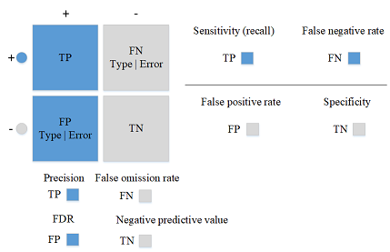

~~~~~~~~~~~~~~~~~~~~~~~~~~~~~~~~~~~~
Matthew correlation coefficient (MCC)
~~~~~~~~~~~~~~~~~~~~~~~~~~~~~~~~~~~~

Compute the Matthews correlation coefficient (MCC)

The Matthews correlation coefficient is used in machine learning as a measure of the quality of binary (two-class) classification problems. It takes into account of true and false positives and negatives and is generally regarded as a balanced measure which can be used even if the classes are of very different sizes. The MCC is in essence a correlation coefficient value between -1 and +1. A coefficient of +1 represents a perfect prediction, 0 an average random prediction and -1 an inverse prediction. The statistic is also known as the phi coefficient. 

.. code:: python

    from sklearn.metrics import matthews_corrcoef
    y_true = [+1, +1, +1, -1]
    y_pred = [+1, -1, +1, +1]
    matthews_corrcoef(y_true, y_pred)  

~~~~~~~~~~~~~~~~~~~~~~~~~~~~~~~~~~~~~~~~
Receiver operating characteristics (ROC)
~~~~~~~~~~~~~~~~~~~~~~~~~~~~~~~~~~~~~~~~

ROC curves are typically used in binary classification to study the output of a classifier. In order to extend ROC curve and ROC area to multi-class or multi-label classification, it is necessary to binarize the output. One ROC curve can be drawn per label, but one can also draw a ROC curve by considering each element of the label indicator matrix as a binary prediction (micro-averaging).

Another evaluation measure for multi-class classification is macro-averaging, which gives equal weight to the classification of each label. [`sources  <http://scikit-learn.org/stable/auto_examples/model_selection/plot_roc.html>`__] 

.. code:: python

    import numpy as np
    import matplotlib.pyplot as plt
    from itertools import cycle

    from sklearn import svm, datasets
    from sklearn.metrics import roc_curve, auc
    from sklearn.model_selection import train_test_split
    from sklearn.preprocessing import label_binarize
    from sklearn.multiclass import OneVsRestClassifier
    from scipy import interp

    # Import some data to play with
    iris = datasets.load_iris()
    X = iris.data
    y = iris.target

    # Binarize the output
    y = label_binarize(y, classes=[0, 1, 2])
    n_classes = y.shape[1]

    # Add noisy features to make the problem harder
    random_state = np.random.RandomState(0)
    n_samples, n_features = X.shape
    X = np.c_[X, random_state.randn(n_samples, 200 * n_features)]

    # shuffle and split training and test sets
    X_train, X_test, y_train, y_test = train_test_split(X, y, test_size=.5,
                                                        random_state=0)

    # Learn to predict each class against the other
    classifier = OneVsRestClassifier(svm.SVC(kernel='linear', probability=True,
                                     random_state=random_state))
    y_score = classifier.fit(X_train, y_train).decision_function(X_test)

    # Compute ROC curve and ROC area for each class
    fpr = dict()
    tpr = dict()
    roc_auc = dict()
    for i in range(n_classes):
        fpr[i], tpr[i], _ = roc_curve(y_test[:, i], y_score[:, i])
        roc_auc[i] = auc(fpr[i], tpr[i])

    # Compute micro-average ROC curve and ROC area
    fpr["micro"], tpr["micro"], _ = roc_curve(y_test.ravel(), y_score.ravel())
    roc_auc["micro"] = auc(fpr["micro"], tpr["micro"])
   

Plot of a ROC curve for a specific class

.. code:: python

    plt.figure()
    lw = 2
    plt.plot(fpr[2], tpr[2], color='darkorange',
             lw=lw, label='ROC curve (area = %0.2f)' % roc_auc[2])
    plt.plot([0, 1], [0, 1], color='navy', lw=lw, linestyle='--')
    plt.xlim([0.0, 1.0])
    plt.ylim([0.0, 1.05])
    plt.xlabel('False Positive Rate')
    plt.ylabel('True Positive Rate')
    plt.title('Receiver operating characteristic example')
    plt.legend(loc="lower right")
    plt.show()

.. image:: /docs/pic/sphx_glr_plot_roc_001.png

~~~~~~~~~~~~~~~~~~~~~~~
Area Under Curve (AUC)
~~~~~~~~~~~~~~~~~~~~~~~

Area  under ROC curve (AUC) is a summary metric that measures the entire area underneath the ROC curve. AUC holds helpful properties, such as  increased  sensitivity in the analysis of variance (ANOVA) tests, independence of decision threshold, invariance to a priori class probability and the indication of how well negative and positive classes are regarding decision index.

.. code:: python

      import numpy as np
      from sklearn import metrics
      fpr, tpr, thresholds = metrics.roc_curve(y, pred, pos_label=2)
      metrics.auc(fpr, tpr)

==========================
Text and Document Datasets
==========================

----

~~~~~
IMDB
~~~~~

- `IMDB Dataset <http://ai.stanford.edu/~amaas/data/sentiment/>`__

Dataset of 25,000 movies reviews from IMDB, labeled by sentiment (positive/negative). Reviews have been preprocessed, and each review is encoded as a sequence of word indexes (integers). For convenience, words are indexed by overall frequency in the dataset, so that for instance the integer "3" encodes the 3rd most frequent word in the data. This allows for quick filtering operations, such as "only consider the top 10,000 most common words, but eliminate the top 20 most common words".

As a convention, "0" does not stand for a specific word, but instead is used to encode any unknown word.

.. code:: python

  from keras.datasets import imdb

  (x_train, y_train), (x_test, y_test) = imdb.load_data(path="imdb.npz",
                                                        num_words=None,
                                                        skip_top=0,
                                                        maxlen=None,
                                                        seed=113,
                                                        start_char=1,
                                                        oov_char=2,
                                                        index_from=3)

~~~~~~~~~~~~~
Reuters-21578
~~~~~~~~~~~~~

- `Reters-21578 Dataset <https://keras.io/datasets/>`__

Dataset of 11,228 newswires from Reuters, labeled over 46 topics. As with the IMDB dataset, each wire is encoded as a sequence of word indexes (same conventions).

.. code:: python

  from keras.datasets import reuters

  (x_train, y_train), (x_test, y_test) = reuters.load_data(path="reuters.npz",
                                                           num_words=None,
                                                           skip_top=0,
                                                           maxlen=None,
                                                           test_split=0.2,
                                                           seed=113,
                                                           start_char=1,
                                                           oov_char=2,
                                                           index_from=3)
                                                         
                                                         
~~~~~~~~~~~~~
20Newsgroups
~~~~~~~~~~~~~

- `20Newsgroups Dataset <https://archive.ics.uci.edu/ml/datasets/Twenty+Newsgroups>`__

The 20 newsgroups dataset comprises around 18000 newsgroups posts on 20 topics split in two subsets: one for training (or development) and the other one for testing (or for performance evaluation). The split between the train and test set is based upon messages posted before and after a specific date.

This module contains two loaders. The first one, sklearn.datasets.fetch_20newsgroups, returns a list of the raw texts that can be fed to text feature extractors, such as sklearn.feature_extraction.text.CountVectorizer with custom parameters so as to extract feature vectors. The second one, sklearn.datasets.fetch_20newsgroups_vectorized, returns ready-to-use features, i.e., it is not necessary to use a feature extractor.

.. code:: python

  from sklearn.datasets import fetch_20newsgroups
  newsgroups_train = fetch_20newsgroups(subset='train')

  from pprint import pprint
  pprint(list(newsgroups_train.target_names))
  
  ['alt.atheism',
   'comp.graphics',
   'comp.os.ms-windows.misc',
   'comp.sys.ibm.pc.hardware',
   'comp.sys.mac.hardware',
   'comp.windows.x',
   'misc.forsale',
   'rec.autos',
   'rec.motorcycles',
   'rec.sport.baseball',
   'rec.sport.hockey',
   'sci.crypt',
   'sci.electronics',
   'sci.med',
   'sci.space',
   'soc.religion.christian',
   'talk.politics.guns',
   'talk.politics.mideast',
   'talk.politics.misc',
   'talk.religion.misc']
 
 
~~~~~~~~~~~~~~~~~~~~~~
Web of Science Dataset
~~~~~~~~~~~~~~~~~~~~~~

Description of Dataset:

Here is three datasets which include WOS-11967 , WOS-46985, and WOS-5736
Each folder contains:

- X.txt
- Y.txt
- YL1.txt
- YL2.txt

X is input data that include text sequences
Y is target value
YL1 is target value of level one (parent label)
YL2 is target value of level one (child label)

Meta-data:
This folder contain on data file as following attribute:
Y1 Y2 Y Domain area keywords Abstract

Abstract is input data that include text sequences of 46,985 published paper
Y is target value
YL1 is target value of level one (parent label)
YL2 is target value of level one (child label)
Domain is majaor domain which include 7 labales: {Computer Science,Electrical Engineering, Psychology, Mechanical Engineering,Civil Engineering, Medical Science, biochemistry}
area is subdomain or area of the paper, such as CS-> computer graphics which contain 134 labels.
keywords : is authors keyword of the papers

-  Web of Science Dataset `WOS-11967 <http://dx.doi.org/10.17632/9rw3vkcfy4.2>`__
..

  This dataset contains 11,967 documents with 35 categories which include 7 parents categories.

-  Web of Science Dataset `WOS-46985 <http://dx.doi.org/10.17632/9rw3vkcfy4.2>`__
      
..

  This dataset contains 46,985 documents with 134 categories which include 7 parents categories.

-  Web of Science Dataset `WOS-5736 <http://dx.doi.org/10.17632/9rw3vkcfy4.2>`__

..
  
  This dataset contains 5,736 documents with 11 categories which include 3 parents categories.

Referenced paper: HDLTex: Hierarchical Deep Learning for Text Classification

         
================================
Text Classification Applications
================================

----

~~~~~~~~~~~~~~~~~~~~~~
Information Retrieval
~~~~~~~~~~~~~~~~~~~~~~
Information retrieval is finding documents of an unstructured data that meet an information need from within large collections of documents. With the rapid growth of online information, particularly in text format, text classification has become a  significant technique for managing this type of data. Some of the important methods used in this area are Naive Bayes, SVM, decision tree, J48, k-NN and IBK. One of the most challenging applications for document and text dataset processing is applying document categorization methods for information retrieval.

- 🎓 `Introduction to information retrieval <http://eprints.bimcoordinator.co.uk/35/>`__ Manning, C., Raghavan, P., & Schütze, H. (2010).
     
- 🎓 `Web forum retrieval and text analytics: A survey <http://www.nowpublishers.com/article/Details/INR-062>`__ Hoogeveen, Doris, et al.. (2018).

- 🎓 `Automatic Text Classification in Information retrieval: A Survey <https://dl.acm.org/citation.cfm?id=2905191>`__ Dwivedi, Sanjay K., and Chandrakala Arya.. (2016).

~~~~~~~~~~~~~~~~~~~~~~
Information Filtering
~~~~~~~~~~~~~~~~~~~~~~
Information filtering refers to selection of relevant information or rejection of irrelevant information from a stream of incoming data. Information filtering systems are typically used to measure and forecast users' long-term interests. Probabilistic models, such as Bayesian inference network, are commonly used in information filtering systems. Bayesian inference networks employ recursive inference to propagate values through the inference network and return documents with the highest ranking. Chris used vector space model with iterative refinement for filtering task.
 

- 🎓 `Search engines: Information retrieval in practice <http://library.mpib-berlin.mpg.de/toc/z2009_2465.pdf/>`__ Croft, W. B., Metzler, D., & Strohman, T. (2010).

- 🎓 `Implementation of the SMART information retrieval system <https://ecommons.cornell.edu/bitstream/handle/1813/6526/85-686.pdf?sequence=1>`__ Buckley, Chris

~~~~~~~~~~~~~~~~~~~~~~
Sentiment Analysis
~~~~~~~~~~~~~~~~~~~~~~
Sentiment analysis is a computational approach toward identifying opinion, sentiment, and subjectivity in text. Sentiment classification methods classify a document associated with an opinion to be positive or negative. The assumption is that document d is expressing an opinion on a single entity e and opinions are formed via a single opinion holder h. Naive Bayesian classification and SVM are some of the most popular supervised learning methods that have been used for sentiment classification. Features such as terms and their respective frequency, part of speech, opinion words and phrases, negations and syntactic dependency have been used in sentiment classification techniques.

- 🎓 `Opinion mining and sentiment analysis <http://www.nowpublishers.com/article/Details/INR-011>`__ Pang, Bo, and Lillian Lee. (2008).

- 🎓 `A survey of opinion mining and sentiment analysis <https://link.springer.com/chapter/10.1007/978-1-4614-3223-4_13>`__ Liu, Bing, and Lei Zhang. (2010).

- 🎓 `Thumbs up?: sentiment classification using machine learning techniques <https://dl.acm.org/citation.cfm?id=1118704>`__ Pang, Bo, Lillian Lee, and Shivakumar Vaithyanathan. 

~~~~~~~~~~~~~~~~~~~~~~
Recommender Systems
~~~~~~~~~~~~~~~~~~~~~~
Content-based recommender systems suggest items to users based on the description of an item and a profile of the user's interests. 
A user's profile can be learned from user feedback (history of the search queries or self reports) on items as well as self-explained features~(filter or conditions on the queries) in one's profile. 
In this way, input to such recommender systems can be semi-structured such that some attributes are extracted from free-text field while others are directly specified. Many different types of text classification methods, such as decision trees, nearest neighbor methods, Rocchio's algorithm, linear classifiers, probabilistic methods, and Naive Bayes, have been used to model user's preference.

- 🎓 `Content-based recommender systems <https://link.springer.com/chapter/10.1007/978-3-319-29659-3_4>`__ Aggarwal, Charu C. (2016).

- 🎓 `Content-based recommendation systems <https://link.springer.com/chapter/10.1007/978-3-540-72079-9_10>`__ Pazzani, Michael J., and Daniel Billsus.

~~~~~~~~~~~~~~~~~~~~~~
Knowledge Management
~~~~~~~~~~~~~~~~~~~~~~
Textual databases are significant sources of information and knowledge. A large percentage of corporate information (nearly 80 %) exists in textual data formats (unstructured). In knowledge distillation, patterns or knowledge are inferred from immediate forms that can be semi-structured ( e.g.conceptual graph representation) or structured/relational data representation). A given intermediate form can be document-based such that each entity represents an object or concept of interest in a particular domain. Document categorization is one of the most common methods for mining document-based intermediate forms. In the other work, text classification has been used to find the relationship between railroad accidents' causes and their correspondent descriptions in reports.

- 🎓 `Text mining: concepts, applications, tools and issues-an overview <http://citeseerx.ist.psu.edu/viewdoc/download?doi=10.1.1.403.2426&rep=rep1&type=pdf>`__ Sumathy, K. L., and M. Chidambaram.  (2013).

- 🎓 `Analysis of Railway Accidents' Narratives Using Deep Learning <https://ieeexplore.ieee.org/abstract/document/8614260/>`__ Heidarysafa, Mojtaba, et al. (2018).

~~~~~~~~~~~~~~~~~~~~~~
Document Summarization
~~~~~~~~~~~~~~~~~~~~~~
Text classification used for document summarizing which summary of a document may employ words or phrases which do not appear in the original document.  Multi-document summarization also is necessitated due to increasing online information rapidly. So, many researchers focus on this task using text classification to extract important feature out of a document.

- 🎓 `Advances in automatic text summarization <https://books.google.com/books?hl=en&lr=&id=YtUZQaKDmzEC&oi=fnd&pg=PA215&dq=Advances+in+automatic+text+summarization&ots=ZpvCsrG-dC&sig=8ecTDTrQR4mMzDnKvI58sowh3Fg>`__ Mani, Inderjeet. 

- 🎓 `Improving Multi-Document Summarization via Text Classification. <https://www.aaai.org/ocs/index.php/AAAI/AAAI17/paper/viewPaper/14525>`__ Cao, Ziqiang, et al. (2017).

================================
Text Classification Support
================================

~~~~~~~~~~~~~~~~~~~~~~
Health
~~~~~~~~~~~~~~~~~~~~~~
Most textual information in the medical domain is presented in an unstructured or narrative form with ambiguous terms and typographical errors. Such information needs to be available instantly throughout the patient-physicians encounters in different stages of diagnosis and treatment. Medical coding, which consists of assigning medical diagnoses to specific class values obtained from a large set of categories, is an area of healthcare applications where text classification techniques can be highly valuable. In the other research, J. Zhang et al. introduced Patient2Vec, to learn an interpretable deep representation of longitudinal electronic health record (EHR) data which is personalized for each patient. Patient2Vec is a novel technique of text dataset feature embedding that can learn a personalized interpretable deep representation of EHR data based on recurrent neural networks and the attention mechanism. Text classification has also been applied in the development of Medical Subject Headings (MeSH) and Gene Ontology (GO). 

- 🎓 `Patient2Vec: A Personalized Interpretable Deep Representation of the Longitudinal Electronic Health Record <https://ieeexplore.ieee.org/abstract/document/8490816/>`__ Zhang, Jinghe, et al. (2018)

- 🎓 `Combining Bayesian text classification and shrinkage to automate healthcare coding: A data quality analysis <https://dl.acm.org/citation.cfm?id=2063506>`__ Lauría, Eitel JM, and Alan D. March. (2011).

- 🎓 `A <http://b/>`__ c. (2010).

- 🎓 `MeSH Up: effective MeSH text classification for improved document retrieval <https://academic.oup.com/bioinformatics/article-abstract/25/11/1412/333120>`__ Trieschnigg, Dolf, et al.

~~~~~~~~~~~~~~~~~~~~~~
Social Sciences
~~~~~~~~~~~~~~~~~~~~~~
Text classification and document categorization has increasingly been applied to understanding human behavior in past decades. Recent data-driven efforts in human behavior research have focused on mining language contained in informal notes and text datasets, including short message service (SMS), clinical notes, social media, etc. These studies have mostly focused on using approaches based on frequencies of word occurrence (i.e. how often a word appears in a document) or features based on Linguistic Inquiry Word Count (LIWC), a well-validated lexicon of categories of words with psychological relevance.

- 🎓 `Identification of imminent suicide risk among young adults using text messages <https://dl.acm.org/citation.cfm?id=3173987>`__ Nobles, Alicia L., et al. (2018).

- 🎓 `Textual Emotion Classification: An Interoperability Study on Cross-Genre Data Sets <https://link.springer.com/chapter/10.1007/978-3-319-63004-5_21>`__ Ofoghi, Bahadorreza, and Karin Verspoor. (2017).

- 🎓 `Social Monitoring for Public Health <https://www.morganclaypool.com/doi/abs/10.2200/S00791ED1V01Y201707ICR060>`__ Paul, Michael J., and Mark Dredze (2017).

~~~~~~~~~~~~~~~~~~~~~~
Business and Marketing
~~~~~~~~~~~~~~~~~~~~~~
profitable companies and organizations are progressively using social media for marketing purposes. Opening mining from social media such as Facebook, Twitter, and so on is main target of companies to rapidly increase their profits. Text and documents classification is a powerful tool for companies to find their customers easier than ever.  

- 🎓 `Opinion mining using ensemble text hidden Markov models for text classification <https://www.sciencedirect.com/science/article/pii/S0957417417304979>`__ Kang, Mangi, Jaelim Ahn, and Kichun Lee. (2018).

- 🎓 `Classifying business marketing messages on Facebook <https://www.researchgate.net/profile/Bei_Yu2/publication/236246670_Classifying_Business_Marketing_Messages_on_Facebook/links/56bcb34408ae6cc737c6335b.pdf>`__ Yu, Bei, and Linchi Kwok.

~~~~~~~~~~~~~~~~~~~~~~
Law
~~~~~~~~~~~~~~~~~~~~~~
Huge volumes of legal text information and documents have been generated by governmental institutions. Retrieving this information and automatically classifying it can not only help lawyers but also their clients.
In the United States, the law is derived from five sources: constitutional law, statutory law, treaties, administrative regulations, and the common law. Also, many new legal documents are created each year. Categorization of these documents is the main challenge of the lawyer community.

- 🎓 `Represent yourself in court: How to prepare & try a winning case <https://books.google.com/books?hl=en&lr=&id=-lodDQAAQBAJ&oi=fnd&pg=PP1&dq=Represent+yourself+in+court:+How+to+prepare+%5C%26+try+a+winning+case&ots=tgJ8Q2MkH_&sig=9o3ILDn3LfO30BZKsyI2Ou7Q8Qs>`__ Bergman, Paul, and Sara J. Berman. (2016)

- 🎓 `Text retrieval in the legal world <https://link.springer.com/article/10.1007/BF00877694>`__ Turtle, Howard.

==========
Citations:
==========

----

.. code::

    @ARTICLE{Kowsari2018Text_Classification,
        title={Text Classification Algorithms: A Survey},
        author={Kowsari, Kamran and Jafari Meimandi, Kiana and Heidarysafa, Mojtaba and Mendu, Sanjana and Barnes, Laura E. and Brown, Donald E.},
        journal={Information},
        VOLUME = {10},  
        YEAR = {2019},
        NUMBER = {4},
        ARTICLE-NUMBER = {150},
        URL = {http://www.mdpi.com/2078-2489/10/4/150},
        ISSN = {2078-2489},
        publisher={Multidisciplinary Digital Publishing Institute}
    }

.. |RMDL| image:: http://kowsari.net/onewebmedia/RMDL.jpg

.. |HDLTex| image:: http://kowsari.net/____impro/1/onewebmedia/HDLTex.png?etag=W%2F%22c90cd-59c4019b%22&sourceContentType=image%2Fpng&ignoreAspectRatio&resize=821%2B326&extract=0%2B0%2B821%2B325?raw=false

.. |twitter| image:: https://img.shields.io/twitter/url/http/shields.io.svg?style=social
    :target: https://twitter.com/intent/tweet?text=Text%20Classification%20Algorithms:%20A%20Survey%0aGitHub:&url=https://github.com/kk7nc/Text_Classification&hashtags=Text_Classification,classification,MachineLearning,Categorization,NLP,NATURAL,LANGUAGE,PROCESSING
    
.. |contributions-welcome| image:: https://img.shields.io/badge/contributions-welcome-brightgreen.svg?style=flat
    :target: https://github.com/kk7nc/Text_Classification/pulls
.. |ansicolortags| image:: https://img.shields.io/pypi/l/ansicolortags.svg
      :target: https://github.com/kk7nc/Text_Classification/blob/master/LICENSE
.. |contributors| image:: https://img.shields.io/github/contributors/kk7nc/Text_Classification.svg
      :target: https://github.com/kk7nc/Text_Classification/graphs/contributors 

.. |arXiv| image:: https://img.shields.io/badge/arXiv-1904.08067-red.svg?style=flat
   :target: https://arxiv.org/abs/1904.08067
   
.. |DOI| image:: https://img.shields.io/badge/DOI-10.3390/info10040150-blue.svg?style=flat
   :target: https://doi.org/10.3390/info10040150
   
   
.. |medium| image:: https://img.shields.io/badge/Medium-Text%20Classification-blueviolet.svg
    :target: https://medium.com/text-classification-algorithms/text-classification-algorithms-a-survey-a215b7ab7e2d
    
.. |mendeley| image:: https://img.shields.io/badge/Mendeley-Add%20to%20Library-critical.svg
    :target: https://www.mendeley.com/import/?url=https://doi.org/10.3390/info10040150
