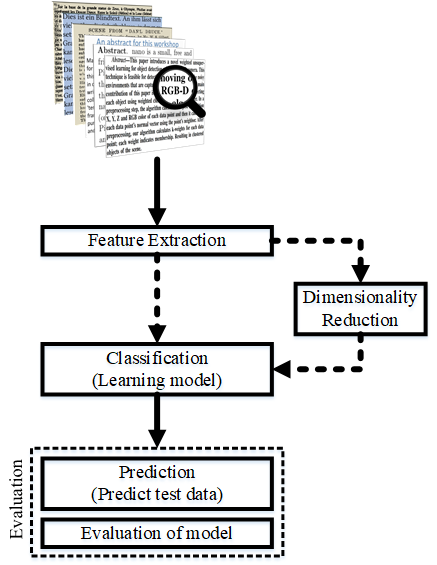

################################################
Text Classification Algorithms: A Survey
################################################

.. image:: https://img.shields.io/badge/contributions-welcome-brightgreen.svg?style=flat
    :target: https://github.com/kk7nc/Text_Classification/pulls
.. image:: https://badges.frapsoft.com/os/v2/open-source.png?v=103
    :target: https://github.com/ellerbrock/open-source-badge/
.. image:: https://img.shields.io/pypi/l/ansicolortags.svg
      :target: https://github.com/kk7nc/Text_Classification/blob/master/LICENSE
.. image:: https://img.shields.io/github/contributors/Naereen/StrapDown.js.svg
      :target: https://github.com/kk7nc/Text_Classification/graphs/contributors
      
      
##################
Table of Contents
##################
.. contents::
  :local:
  :depth: 4

============
Introduction
============

    
    
====================================
Text and Document Feature Extraction
====================================

----

Text feature extraction and pre-processing for classification algorithm is very significant. In this section, we start to talk about text cleaning which most of documents have a lot of noise. In this part we discuss about two main methods of text feature extractions which are word embedding and weighted word.

~~~~~~~~~~~~~~~~~~~~~~~~~~~~~~~~
Text Cleaning and Pre-processing
~~~~~~~~~~~~~~~~~~~~~~~~~~~~~~~~

In Natural Language Processing (NLP), most of the text and document datasets contains many unnecessary words such as Stopwords, miss-spelling, slang, and etc. In this section, we briefly explain some techniques and method for text cleaning and pre-processing text datasets. In many algorithm, especially statistical and probabilistic learning algorithm, noise and unnecessary features could have bad effect on performance of the system, so one of the solution could be illumination and remove these features as pre-processing step.

-------------
Tokenization
-------------

Tokenization is a part of pre-process to break a stream of text up into words, phrases, symbols, or other meaningful elements called tokens.  The main goal of this step is the exploration of the words in a sentence. In text mining beside of text classification, it;'s necessitate a parser which processes the tokenization of the documents; for example:

sentence:

.. code::

  After sleeping for four hours, he decided to sleep for another four

In this case, the tokens are as follows:

.. code::

    {'After', 'sleeping', 'for', 'four', 'hours', 'he', 'decided', 'to', 'sleep', 'for', 'another', 'four'}

Here is python code for Tokenization:

.. code:: python

  from nltk.tokenize import word_tokenize
  text = "After sleeping for four hours, he decided to sleep for another four"
  tokens = word_tokenize(text)
  print(tokens)

-----------
Stop words
-----------

Text and document classification over social media such as Twitter, Facebook, and so on is usually affected by the noisy nature (abbreviations, irregular forms) of these data points.

Here is an exmple from  `geeksforgeeks <https://www.geeksforgeeks.org/removing-stop-words-nltk-python/>`__

.. code:: python

  from nltk.corpus import stopwords
  from nltk.tokenize import word_tokenize

  example_sent = "This is a sample sentence, showing off the stop words filtration."

  stop_words = set(stopwords.words('english'))

  word_tokens = word_tokenize(example_sent)

  filtered_sentence = [w for w in word_tokens if not w in stop_words]

  filtered_sentence = []

  for w in word_tokens:
      if w not in stop_words:
          filtered_sentence.append(w)

  print(word_tokens)
  print(filtered_sentence)

Output:

.. code::

  ['This', 'is', 'a', 'sample', 'sentence', ',', 'showing', 
  'off', 'the', 'stop', 'words', 'filtration', '.']
  ['This', 'sample', 'sentence', ',', 'showing', 'stop',
  'words', 'filtration', '.']

---------------
Capitalization
---------------

Text and document data points have a diversity of capitalization to became a sentence; substantially, several sentences together create a document. The most common approach of capitalization method could be to reduce everything to lower case. This technique makes all words in text and document in same space, but it is caused to a significant problem for meaning of some words such as "US" to "us" which first one represent the country of United States of America and second one is pronouns word; thus, for solving this problem, we could use slang and abbreviation converters.

.. code:: python

  text = "The United States of America (USA) or America, is a federal republic composed of 50 states"
  print(text)
  print(text.lower())

Output:

.. code:: python

  "The United States of America (USA) or America, is a federal republic composed of 50 states"
  "the united states of america (usa) or america, is a federal republic composed of 50 states"

-----------------------
Slang and Abbreviation
-----------------------

Slang and Abbreviation is another problem as pre-processing step for cleaning text datasets. An abbreviation  is a shortened form of a word or phrase which contain mostly first letters form the words such as SVM stand for  Support Vector Machine. Slang is a version of language of an informal talk or text that has different meaning such as "lost the plot", it essentially means that they've gone mad. The common method for dealing with these words is convert them to formal language.

---------------
Noise Removal
---------------

The other issue of text cleaning as pre-processing step is noise removal which most of text and document datasets contains many unnecessary characters such as punctuation, special character. It's important to know the punctuation is critical for us to understand the meaning of the sentence, but it could have effect for classification algorithms.

Here is simple code to remove standard noise from text:

.. code:: python

  def text_cleaner(text):
      rules = [
          {r'>\s+': u'>'},  # remove spaces after a tag opens or closes
          {r'\s+': u' '},  # replace consecutive spaces
          {r'\s*<br\s*/?>\s*': u'\n'},  # newline after a  
          {r'</(div)\s*>\s*': u'\n'},  # newline after 
 and 
 and <h1/>...
          {r'</(p|h\d)\s*>\s*': u'\n\n'},  # newline after 
 and 
 and <h1/>...
          {r'<head>.*<\s*(/head|body)[^>]*>': u''},  # remove <head> to </head>
          {r'<a\s+href="([^"]+)"[^>]*>.*</a>': r'\1'},  # show links instead of texts
          {r'[ \t]*<[^<]*?/?>': u''},  # remove remaining tags
          {r'^\s+': u''}  # remove spaces at the beginning
      ]
      for rule in rules:
      for (k, v) in rule.items():
          regex = re.compile(k)
          text = regex.sub(v, text)
      text = text.rstrip()
      return text.lower()
    

-------------------
Spelling Correction
-------------------

One of the optional part of the pre-processing step is spelling correction which is happened in texts and documents. Many algorithm, techniques, and methods have been addressed this problem in NLP. Many techniques and methods are available for researchers such as hashing-based and context-sensitive spelling correction techniques, or  spelling correction using trie and damerau-levenshtein distance bigram.

.. code:: python

  from autocorrect import spell

  print spell('caaaar')
  print spell(u'mussage')
  print spell(u'survice')
  print spell(u'hte')

Result:

.. code::

    caesar
    message
    service
    the

------------
Stemming
------------

Text Stemming is modifying to obtain variant word forms using different linguistic processes such as affixation (addition of affixes). For example, the stem of the word "studying" is "study", to which -ing.

Here is an example of Stemming from `NLTK <https://pythonprogramming.net/stemming-nltk-tutorial/>`__

.. code:: python

    from nltk.stem import PorterStemmer
    from nltk.tokenize import sent_tokenize, word_tokenize

    ps = PorterStemmer()

    example_words = ["python","pythoner","pythoning","pythoned","pythonly"]
    
    for w in example_words:
    print(ps.stem(w))

Result:

.. code::

  python
  python
  python
  python
  pythonli

-------------
Lemmatization
-------------

Text lemmatization is process in NLP to replaces the suffix of a word with a different one or removes the suffix of a word completely to get the basic word form (lemma).

.. code:: python

  from nltk.stem import WordNetLemmatizer

  lemmatizer = WordNetLemmatizer()

  print(lemmatizer.lemmatize("cats"))

~~~~~~~~~~~~~~
Word Embedding
~~~~~~~~~~~~~~

Different word embedding has been proposed to translate these unigrams into understandable input for machine learning algorithms. Most basic methods to perform such embedding is term-frequency~(TF) where each word will be mapped to a number corresponding to the number of occurrence of that word in the whole corpora. The other term frequency functions have been also used that present words frequency as Boolean or logarithmically scaled number. As regarding to results, each document will be translated to a vector with the length of document, containing the frequency of the words in that document. Although such approach is very intuitive but it suffers from the fact that particular words that are used commonly in language literature would dominate such word representation.

.. image:: docs/pic/CBOW.png

--------
Word2Vec
--------

Original from https://code.google.com/p/word2vec/

I’ve copied it to a github project so I can apply and track community
patches for my needs (starting with capability for Mac OS X
compilation).

-  **makefile and some source has been modified for Mac OS X
   compilation** See
   https://code.google.com/p/word2vec/issues/detail?id=1#c5
-  **memory patch for word2vec has been applied** See
   https://code.google.com/p/word2vec/issues/detail?id=2
-  Project file layout altered

There seems to be a segfault in the compute-accuracy utility.

To get started:

::

   cd scripts && ./demo-word.sh

Original README text follows:

This tool provides an efficient implementation of the continuous bag-of-words and skip-gram architectures for computing vector representations of words. These representations can be subsequently used in many natural language processing applications and for further research. 

this code provides an implementation of the Continuous Bag-of-Words (CBOW) and
the Skip-gram model (SG), as well as several demo scripts.

Given a text corpus, the word2vec tool learns a vector for every word in
the vocabulary using the Continuous Bag-of-Words or the Skip-Gram neural
network architectures. The user should to specify the following: -
desired vector dimensionality - the size of the context window for
either the Skip-Gram or the Continuous Bag-of-Words model - training
algorithm: hierarchical softmax and / or negative sampling - threshold
for downsampling the frequent words - number of threads to use - the
format of the output word vector file (text or binary)

Usually, the other hyper-parameters such as the learning rate do not
need to be tuned for different training sets.

The script demo-word.sh downloads a small (100MB) text corpus from the
web, and trains a small word vector model. After the training is
finished, the user can interactively explore the similarity of the
words.

More information about the scripts is provided at
https://code.google.com/p/word2vec/

----------------------------------------------
Global Vectors for Word Representation (GloVe)
----------------------------------------------

.. image:: /docs/pic/Glove.PNG

An implementation of the GloVe model for learning word representations is provided, and describe how to download web-dataset vectors or train your own. See the  `project page <http://nlp.stanford.edu/projects/glove/>`__  or the   `paper <http://nlp.stanford.edu/pubs/glove.pdf>`__  for more information on glove vectors.

--------
FastText
--------

~~~~~~~~~~~~~~
Weighted Words
~~~~~~~~~~~~~~

--------------
Term frequency
--------------

Term frequency is Bag of words that is simplest technique of text feature extraction. This method is based on counting number of the words in each document and assign it to feature space.

-----------------------------------------
Term Frequency-Inverse Document Frequency
-----------------------------------------
The mathematical representation of weight of a term in a document by Tf-idf is given:

.. image:: docs/eq/tf-idf.gif
   :width: 10px
   
Where N is number of documents and df(t) is the number of documents containing the term t in the corpus. The first part would improve recall and the later would improve the precision of the word embedding. Although tf-idf tries to overcome the problem of common terms in document, it still suffers from some other descriptive limitations. Namely, tf-idf cannot account for the similarity between words in the document since each word is presented as an index. In the recent years, with development of more complex models such as neural nets, new methods has been presented that can incorporate concepts such as similarity of words and part of speech tagging. This work uses, word2vec and Glove, two of the most common methods that have been successfully used for deep learning techniques.

.. code:: python

    from sklearn.feature_extraction.text import TfidfTransformer
    def loadData(X_train, X_test,MAX_NB_WORDS=75000):
        vectorizer_x = TfidfVectorizer(max_features=MAX_NB_WORDS)
        X_train = vectorizer_x.fit_transform(X_train).toarray()
        X_test = vectorizer_x.transform(X_test).toarray()
        print("tf-idf with",str(np.array(X_train).shape[1]),"features")
        return (X_train,X_test)

========================
Dimensionality Reduction
========================

----

~~~~~~~~~~~~~~~~~~~~~~~~~~~~~~~~~~
Principal Component Analysis (PCA)
~~~~~~~~~~~~~~~~~~~~~~~~~~~~~~~~~~
Principle component analysis~(PCA) is the most popular technique in multivariate analysis and dimensionality reduction. PCA is a method to identify a subspace in which the data approximately lies. This means finding new variables that are uncorrelated and maximizing the variance to preserve as much variability as possible.

Example of PCA on text dataset (20newsgroups) from  tf-idf with 75000 features to 2000 components:

.. code:: python

    from sklearn.feature_extraction.text import TfidfVectorizer
    import numpy as np

    def TFIDF(X_train, X_test, MAX_NB_WORDS=75000):
        vectorizer_x = TfidfVectorizer(max_features=MAX_NB_WORDS)
        X_train = vectorizer_x.fit_transform(X_train).toarray()
        X_test = vectorizer_x.transform(X_test).toarray()
        print("tf-idf with", str(np.array(X_train).shape[1]), "features")
        return (X_train, X_test)

    from sklearn.datasets import fetch_20newsgroups

    newsgroups_train = fetch_20newsgroups(subset='train')
    newsgroups_test = fetch_20newsgroups(subset='test')
    X_train = newsgroups_train.data
    X_test = newsgroups_test.data
    y_train = newsgroups_train.target
    y_test = newsgroups_test.target

    X_train,X_test = TFIDF(X_train,X_test)

    from sklearn.decomposition import PCA
    pca = PCA(n_components=2000)
    X_train_new = pca.fit_transform(X_train)
    X_test_new = pca.transform(X_test)

    print("train with old features: ",np.array(X_train).shape)
    print("train with new features:" ,np.array(X_train_new).shape)
    
    print("test with old features: ",np.array(X_test).shape)
    print("test with new features:" ,np.array(X_test_new).shape)

output:

.. code:: python

    tf-idf with 75000 features
    train with old features:  (11314, 75000)
    train with new features: (11314, 2000)
    test with old features:  (7532, 75000)
    test with new features: (7532, 2000)

~~~~~~~~~~~~~~~~~~~~~~~~~~~~~~~~~~
Linear Discriminant Analysis (LDA)
~~~~~~~~~~~~~~~~~~~~~~~~~~~~~~~~~~

~~~~~~~~~~~~~~~~~~~~~~~~~~~~~~~~~~~~~~~
Non-negative Matrix Factorization (NMF)
~~~~~~~~~~~~~~~~~~~~~~~~~~~~~~~~~~~~~~~

~~~~~~~~~~~~~~~~~
Random Projection
~~~~~~~~~~~~~~~~~
Random projection or random feature is technique for dimensionality reduction which is mostly used for very large volume dataset or very high dimensional feature space. Text and document, especially with weighted feature extraction, generate huge number of features.
Many researchers addressed Random Projection for text data for text mining, text classification and/or dimensionality reduction.
we start to review some random projection techniques. 

.. image:: docs/pic/Random%20Projection.png

.. code:: python

    from sklearn.feature_extraction.text import TfidfVectorizer
    import numpy as np

    def TFIDF(X_train, X_test, MAX_NB_WORDS=75000):
        vectorizer_x = TfidfVectorizer(max_features=MAX_NB_WORDS)
        X_train = vectorizer_x.fit_transform(X_train).toarray()
        X_test = vectorizer_x.transform(X_test).toarray()
        print("tf-idf with", str(np.array(X_train).shape[1]), "features")
        return (X_train, X_test)

    from sklearn.datasets import fetch_20newsgroups

    newsgroups_train = fetch_20newsgroups(subset='train')
    newsgroups_test = fetch_20newsgroups(subset='test')
    X_train = newsgroups_train.data
    X_test = newsgroups_test.data
    y_train = newsgroups_train.target
    y_test = newsgroups_test.target

    X_train,X_test = TFIDF(X_train,X_test)

    from sklearn import random_projection

    RandomProjection = random_projection.GaussianRandomProjection(n_components=2000)
    X_train_new = RandomProjection.fit_transform(X_train)
    X_test_new = RandomProjection.transform(X_test)

    print("train with old features: ",np.array(X_train).shape)
    print("train with new features:" ,np.array(X_train_new).shape)

    print("test with old features: ",np.array(X_test).shape)
    print("test with new features:" ,np.array(X_test_new).shape)

output:

.. code:: python

    tf-idf with 75000 features
    train with old features:  (11314, 75000)
    train with new features: (11314, 2000)
    test with old features:  (7532, 75000)
    test with new features: (7532, 2000)
    
~~~~~~~~~~~
Autoencoder
~~~~~~~~~~~

Autoencoder is a neural network technique that is trained to attempt to copy its input to its output. The autoencoder as dimensional reduction methods have achieved great success via the powerful reprehensibility of neural networks. The main idea is one hidden layer between input and output layers has fewer units which could be used as reduced dimension of feature space. Specially for texts, documents, and sequences that contains many features, autoencoder could help to process of data faster and more efficient.

.. image:: docs/pic/Autoencoder.png

.. code:: python

  from keras.layers import Input, Dense
  from keras.models import Model

  # this is the size of our encoded representations
  encoding_dim = 1500  

  # this is our input placeholder
  input = Input(shape=(n,))
  # "encoded" is the encoded representation of the input
  encoded = Dense(encoding_dim, activation='relu')(input)
  # "decoded" is the lossy reconstruction of the input
  decoded = Dense(n, activation='sigmoid')(encoded)

  # this model maps an input to its reconstruction
  autoencoder = Model(input, decoded)

  # this model maps an input to its encoded representation
  encoder = Model(input, encoded)
  

  encoded_input = Input(shape=(encoding_dim,))
  # retrieve the last layer of the autoencoder model
  decoder_layer = autoencoder.layers[-1]
  # create the decoder model
  decoder = Model(encoded_input, decoder_layer(encoded_input))
  
  autoencoder.compile(optimizer='adadelta', loss='binary_crossentropy')
  
  

Load data:

.. code:: python

  autoencoder.fit(x_train, x_train,
                  epochs=50,
                  batch_size=256,
                  shuffle=True,
                  validation_data=(x_test, x_test))
                  

~~~~~~~~~~~~~~~~~~~~~~~~~~~~~~~~~~~~~~~~~~~~~~~~~~~
T-distributed Stochastic Neighbor Embedding (T-SNE)
~~~~~~~~~~~~~~~~~~~~~~~~~~~~~~~~~~~~~~~~~~~~~~~~~~~

T-distributed Stochastic Neighbor Embedding (T-SNE) is a nonlinear dimensionality reduction method for embedding high-dimensional data for which is mostly used for visualization in a low-dimensional space. This approach is based on `G. Hinton and ST. Roweis <https://www.cs.toronto.edu/~fritz/absps/sne.pdf>`__ . SNE works by converting the high dimensional Euclidean distances into conditional probabilities which represent similarities.

 `Example <http://scikit-learn.org/stable/modules/generated/sklearn.manifold.TSNE.html>`__:

.. code:: python

   import numpy as np
   from sklearn.manifold import TSNE
   X = np.array([[0, 0, 0], [0, 1, 1], [1, 0, 1], [1, 1, 1]])
   X_embedded = TSNE(n_components=2).fit_transform(X)
   X_embedded.shape

Example of Glove and T-SNE for text:

.. image:: docs/pic/TSNE.png

===============================
Text Classification Techniques
===============================

----

~~~~~~~~~~~~~~~~~~~~~~~~~~~~~~~~~~
Rocchio classification
~~~~~~~~~~~~~~~~~~~~~~~~~~~~~~~~~~

The first version of Rocchio algorithm is introduced by rocchio in 1971 to use relevance feedback in querying full-text databases. Since then many researchers addressed and developed this technique for text and document classification. This method uses TF-IDF weights for each informative word instead of a set of Boolean features. Using a training set of documents, Rocchio's algorithm builds a prototype vector for each class which is an average vector over all training document vectors that belongs to a certain class. Then, it will assign each test document to a class with maximum similarity that between test document and each of prototype vectors.

When in nearest centroid classifier, we used for text as input data for classification with tf-idf vectors, this classifier is known as the Rocchio classifier.

.. code:: python

    from sklearn.neighbors.nearest_centroid import NearestCentroid
    from sklearn.pipeline import Pipeline
    from sklearn import metrics
    from sklearn.feature_extraction.text import CountVectorizer
    from sklearn.feature_extraction.text import TfidfTransformer
    from sklearn.datasets import fetch_20newsgroups

    newsgroups_train = fetch_20newsgroups(subset='train')
    newsgroups_test = fetch_20newsgroups(subset='test')
    X_train = newsgroups_train.data
    X_test = newsgroups_test.data
    y_train = newsgroups_train.target
    y_test = newsgroups_test.target

    text_clf = Pipeline([('vect', CountVectorizer()),
                         ('tfidf', TfidfTransformer()),
                         ('clf', NearestCentroid()),
                         ])

    text_clf.fit(X_train, y_train)

    predicted = text_clf.predict(X_test)

    print(metrics.classification_report(y_test, predicted))

Output:

.. code:: python

                  precision    recall  f1-score   support

              0       0.75      0.49      0.60       319
              1       0.44      0.76      0.56       389
              2       0.75      0.68      0.71       394
              3       0.71      0.59      0.65       392
              4       0.81      0.71      0.76       385
              5       0.83      0.66      0.74       395
              6       0.49      0.88      0.63       390
              7       0.86      0.76      0.80       396
              8       0.91      0.86      0.89       398
              9       0.85      0.79      0.82       397
             10       0.95      0.80      0.87       399
             11       0.94      0.66      0.78       396
             12       0.40      0.70      0.51       393
             13       0.84      0.49      0.62       396
             14       0.89      0.72      0.80       394
             15       0.55      0.73      0.63       398
             16       0.68      0.76      0.71       364
             17       0.97      0.70      0.81       376
             18       0.54      0.53      0.53       310
             19       0.58      0.39      0.47       251

    avg / total       0.74      0.69      0.70      7532

~~~~~~~~~~~~~~~~~~~~~~~~~~~~~~~~~~
Boosting and Bagging
~~~~~~~~~~~~~~~~~~~~~~~~~~~~~~~~~~

---------
Boosting
---------

-------
Bagging
-------

~~~~~~~~~~~~~~~~~~~~~~~~~~~~~~~~~~
Logistic Regression
~~~~~~~~~~~~~~~~~~~~~~~~~~~~~~~~~~

~~~~~~~~~~~~~~~~~~~~~~~~~~~~~~~~~~
Naive Bayes Classifier
~~~~~~~~~~~~~~~~~~~~~~~~~~~~~~~~~~

Naïve Bayes text classification has been used in industry
and academia for a long time (introduced by Thomas Bayes
between 1701-1761) ; however, this technique
is studied since 1950s for text and document categorization. Naive Bayes Classifier (NBC) is generative
model which is the most traditional method of text categorization
which is widely used in Information Retrieval. Many researchers addressed and developed this technique
for their applications. We start the most basic version
of NBC which developed by using term-frequency (Bag of
Word) fetaure extraction technique by counting number of
words in documents

.. code:: python

    from sklearn.naive_bayes import MultinomialNB
    from sklearn.pipeline import Pipeline
    from sklearn import metrics
    from sklearn.feature_extraction.text import CountVectorizer
    from sklearn.feature_extraction.text import TfidfTransformer
    from sklearn.datasets import fetch_20newsgroups

    newsgroups_train = fetch_20newsgroups(subset='train')
    newsgroups_test = fetch_20newsgroups(subset='test')
    X_train = newsgroups_train.data
    X_test = newsgroups_test.data
    y_train = newsgroups_train.target
    y_test = newsgroups_test.target

    text_clf = Pipeline([('vect', CountVectorizer()),
                         ('tfidf', TfidfTransformer()),
                         ('clf', MultinomialNB()),
                         ])

    text_clf.fit(X_train, y_train)

    predicted = text_clf.predict(X_test)

    print(metrics.classification_report(y_test, predicted))
 
 
Output:
 
.. code:: python

                   precision    recall  f1-score   support

              0       0.80      0.52      0.63       319
              1       0.81      0.65      0.72       389
              2       0.82      0.65      0.73       394
              3       0.67      0.78      0.72       392
              4       0.86      0.77      0.81       385
              5       0.89      0.75      0.82       395
              6       0.93      0.69      0.80       390
              7       0.85      0.92      0.88       396
              8       0.94      0.93      0.93       398
              9       0.92      0.90      0.91       397
             10       0.89      0.97      0.93       399
             11       0.59      0.97      0.74       396
             12       0.84      0.60      0.70       393
             13       0.92      0.74      0.82       396
             14       0.84      0.89      0.87       394
             15       0.44      0.98      0.61       398
             16       0.64      0.94      0.76       364
             17       0.93      0.91      0.92       376
             18       0.96      0.42      0.58       310
             19       0.97      0.14      0.24       251

    avg / total       0.82      0.77      0.77      7532

~~~~~~~~~~~~~~~~~~~~~~~~~~~~~~~~~~
K-nearest Neighbor
~~~~~~~~~~~~~~~~~~~~~~~~~~~~~~~~~~
R
In machine learning, the k-nearest neighbors algorithm (kNN)
is a non-parametric technique used for classification.
This method is used in Natural-language processing (NLP)
as text classification in many researches in past
decad

.. image:: docs/pic/KNN.png

.. code:: python

  #load data 
  from sklearn.neighbors import KNeighborsClassifier
  neigh = KNeighborsClassifier(n_neighbors=number_of_classes)
  neigh.fit(Xtrain, ytrain)
  new_y  = neigh.predict(Xtext)

~~~~~~~~~~~~~~~~~~~~~~~~~~~~~~~~~~
Support Vector Machine (SVM)
~~~~~~~~~~~~~~~~~~~~~~~~~~~~~~~~~~

The original version of SVM was introduced by Vapnik and  Chervonenkis in 1963. The early 1990s, nonlinear version was addressed by BE. Boser et al.. Original version of SVM was designed for binary classification problem, but Many researchers work on multi-class problem using this authoritative technique.

The advantages of support vector machines are based on scikit-learn page:

* Effective in high dimensional spaces.
* Still effective in cases where number of dimensions is greater than the number of samples.
* Uses a subset of training points in the decision function (called support vectors), so it is also memory efficient.
* Versatile: different Kernel functions can be specified for the decision function. Common kernels are provided, but it is also possible to specify custom kernels.

The disadvantages of support vector machines include:

* If the number of features is much greater than the number of samples, avoid over-fitting in choosing Kernel functions and regularization term is crucial.
* SVMs do not directly provide probability estimates, these are calculated using an expensive five-fold cross-validation (see Scores and probabilities, below).

.. image:: docs/pic/SVM.png

.. code:: python

    from sklearn.svm import LinearSVC
    from sklearn.pipeline import Pipeline
    from sklearn import metrics
    from sklearn.feature_extraction.text import CountVectorizer
    from sklearn.feature_extraction.text import TfidfTransformer
    from sklearn.datasets import fetch_20newsgroups

    newsgroups_train = fetch_20newsgroups(subset='train')
    newsgroups_test = fetch_20newsgroups(subset='test')
    X_train = newsgroups_train.data
    X_test = newsgroups_test.data
    y_train = newsgroups_train.target
    y_test = newsgroups_test.target

    text_clf = Pipeline([('vect', CountVectorizer()),
                         ('tfidf', TfidfTransformer()),
                         ('clf', LinearSVC()),
                         ])

    text_clf.fit(X_train, y_train)

    predicted = text_clf.predict(X_test)

    print(metrics.classification_report(y_test, predicted))

output:

.. code:: python

                   precision    recall  f1-score   support

              0       0.82      0.80      0.81       319
              1       0.76      0.80      0.78       389
              2       0.77      0.73      0.75       394
              3       0.71      0.76      0.74       392
              4       0.84      0.86      0.85       385
              5       0.87      0.76      0.81       395
              6       0.83      0.91      0.87       390
              7       0.92      0.91      0.91       396
              8       0.95      0.95      0.95       398
              9       0.92      0.95      0.93       397
             10       0.96      0.98      0.97       399
             11       0.93      0.94      0.93       396
             12       0.81      0.79      0.80       393
             13       0.90      0.87      0.88       396
             14       0.90      0.93      0.92       394
             15       0.84      0.93      0.88       398
             16       0.75      0.92      0.82       364
             17       0.97      0.89      0.93       376
             18       0.82      0.62      0.71       310
             19       0.75      0.61      0.68       251

    avg / total       0.85      0.85      0.85      7532

~~~~~~~~~~~~~~~~~~~~~~~~~~~~~~~~~~
Decision Tree
~~~~~~~~~~~~~~~~~~~~~~~~~~~~~~~~~~

One of earlier classification algorithm for text and data mining is decision tree. Decision tree classifiers (DTC's) are used successfully in many diverse areas for classification. The structure of this technique is  a hierarchical decomposition of the data space (only train dataset). Decision tree as classification task is introduced by `D. Morgan <http://www.aclweb.org/anthology/P95-1037>`__ and developed by `JR. Quinlan <https://courses.cs.ut.ee/2009/bayesian-networks/extras/quinlan1986.pdf>`__. The main idea is creating tree based on attribute for categorized data points, but main challenge of decision tree is which attribute or feature could be in parents' level and which one should be in child level. for solving this problem, `De Mantaras <https://link.springer.com/article/10.1023/A:1022694001379>`__ introduced statistical modeling for feature selection in tree.

.. code:: python

    from sklearn import tree
    from sklearn.pipeline import Pipeline
    from sklearn import metrics
    from sklearn.feature_extraction.text import CountVectorizer
    from sklearn.feature_extraction.text import TfidfTransformer
    from sklearn.datasets import fetch_20newsgroups

    newsgroups_train = fetch_20newsgroups(subset='train')
    newsgroups_test = fetch_20newsgroups(subset='test')
    X_train = newsgroups_train.data
    X_test = newsgroups_test.data
    y_train = newsgroups_train.target
    y_test = newsgroups_test.target

    text_clf = Pipeline([('vect', CountVectorizer()),
                         ('tfidf', TfidfTransformer()),
                         ('clf', tree.DecisionTreeClassifier()),
                         ])

    text_clf.fit(X_train, y_train)

    predicted = text_clf.predict(X_test)

    print(metrics.classification_report(y_test, predicted))

output:

.. code:: python

                   precision    recall  f1-score   support

              0       0.51      0.48      0.49       319
              1       0.42      0.42      0.42       389
              2       0.51      0.56      0.53       394
              3       0.46      0.42      0.44       392
              4       0.50      0.56      0.53       385
              5       0.50      0.47      0.48       395
              6       0.66      0.73      0.69       390
              7       0.60      0.59      0.59       396
              8       0.66      0.72      0.69       398
              9       0.53      0.55      0.54       397
             10       0.68      0.66      0.67       399
             11       0.73      0.69      0.71       396
             12       0.34      0.33      0.33       393
             13       0.52      0.42      0.46       396
             14       0.65      0.62      0.63       394
             15       0.68      0.72      0.70       398
             16       0.49      0.62      0.55       364
             17       0.78      0.60      0.68       376
             18       0.38      0.38      0.38       310
             19       0.32      0.32      0.32       251

    avg / total       0.55      0.55      0.55      7532

~~~~~~~~~~~~~~~~~~~~~~~~~~~~~~~~~~
Random Forest
~~~~~~~~~~~~~~~~~~~~~~~~~~~~~~~~~~

Random forests or random decision forests technique is an ensemble learning method for text classification. This method is introduced by `T. Kam Ho <https://doi.org/10.1109/ICDAR.1995.598994>`__ in 1995 for first time which used t tree as parallel. This technique is developed by `L. Breiman <https://link.springer.com/article/10.1023/A:1010933404324>`__ in 1999 that they find converge for RF as margin measure.

.. image:: docs/pic/RF.png

.. code:: python

    from sklearn.ensemble import RandomForestClassifier
    from sklearn.pipeline import Pipeline
    from sklearn import metrics
    from sklearn.feature_extraction.text import CountVectorizer
    from sklearn.feature_extraction.text import TfidfTransformer
    from sklearn.datasets import fetch_20newsgroups

    newsgroups_train = fetch_20newsgroups(subset='train')
    newsgroups_test = fetch_20newsgroups(subset='test')
    X_train = newsgroups_train.data
    X_test = newsgroups_test.data
    y_train = newsgroups_train.target
    y_test = newsgroups_test.target

    text_clf = Pipeline([('vect', CountVectorizer()),
                         ('tfidf', TfidfTransformer()),
                         ('clf', RandomForestClassifier(n_estimators=100)),
                         ])

    text_clf.fit(X_train, y_train)

    predicted = text_clf.predict(X_test)

    print(metrics.classification_report(y_test, predicted))

output:

.. code:: python

                    precision    recall  f1-score   support

              0       0.69      0.63      0.66       319
              1       0.56      0.69      0.62       389
              2       0.67      0.78      0.72       394
              3       0.67      0.67      0.67       392
              4       0.71      0.78      0.74       385
              5       0.78      0.68      0.73       395
              6       0.74      0.92      0.82       390
              7       0.81      0.79      0.80       396
              8       0.90      0.89      0.90       398
              9       0.80      0.89      0.84       397
             10       0.90      0.93      0.91       399
             11       0.89      0.91      0.90       396
             12       0.68      0.49      0.57       393
             13       0.83      0.65      0.73       396
             14       0.81      0.88      0.84       394
             15       0.68      0.91      0.78       398
             16       0.67      0.86      0.75       364
             17       0.93      0.78      0.85       376
             18       0.86      0.48      0.61       310
             19       0.79      0.31      0.45       251

    avg / total       0.77      0.76      0.75      7532

~~~~~~~~~~~~~~~~~~~~~~~~~~~~~~~~~~
Conditional Random Field (CRF)
~~~~~~~~~~~~~~~~~~~~~~~~~~~~~~~~~~

~~~~~~~~~~~~~~~~~~~~~~~~~~~~~~~~~~
Deep Learning
~~~~~~~~~~~~~~~~~~~~~~~~~~~~~~~~~~

-----------------------------------------
Deep Neural Networks
-----------------------------------------

Deep Neural Networks' architecture is designed to learn by multi connection of layers that each single layer only receives connection from previous and provides connections only to the next layer in hidden part. The input is a connection of feature space (As discussed in Section Feature_extraction with first hidden layer. For Deep Neural Networks (DNN), input layer could be tf-ifd, word embedding, or etc. as shown in standard DNN in Figure~\ref{fig:DNN}. The output layer is number of classes for multi-class classification and only one output for binary classification. But our main contribution of this paper is that we have many training DNN for different purposes. In our techniques, we have multi-classes DNNs which each learning models is generated randomly (number of nodes in each layer and also number of layers are completely random assigned). Our implementation of Deep Neural Networks (DNN) is discriminative trained model that uses standard back-propagation algorithm using sigmoid or ReLU as activation function. The output layer for multi-class classification, should use Softmax.

.. image:: docs/pic/DNN.png

import packages:

.. code:: python

    from sklearn.datasets import fetch_20newsgroups
    from keras.layers import  Dropout, Dense
    from keras.models import Sequential
    from sklearn.feature_extraction.text import TfidfVectorizer
    import numpy as np
    from sklearn import metrics

convert text to TF-IDF:

.. code:: python

    def TFIDF(X_train, X_test,MAX_NB_WORDS=75000):
        vectorizer_x = TfidfVectorizer(max_features=MAX_NB_WORDS)
        X_train = vectorizer_x.fit_transform(X_train).toarray()
        X_test = vectorizer_x.transform(X_test).toarray()
        print("tf-idf with",str(np.array(X_train).shape[1]),"features")
        return (X_train,X_test)

Build a DNN Model for Text:

.. code:: python

    def Build_Model_DNN_Text(shape, nClasses, dropout=0.5):
        """
        buildModel_DNN_Tex(shape, nClasses,dropout)
        Build Deep neural networks Model for text classification
        Shape is input feature space
        nClasses is number of classes
        """
        model = Sequential()
        node = 512 # number of nodes
        nLayers = 4 # number of  hidden layer

        model.add(Dense(node,input_dim=shape,activation='relu'))
        model.add(Dropout(dropout))
        for i in range(0,nLayers):
            model.add(Dense(node,input_dim=node,activation='relu'))
            model.add(Dropout(dropout))
        model.add(Dense(nClasses, activation='softmax'))

        model.compile(loss='sparse_categorical_crossentropy',
                      optimizer='adam',
                      metrics=['accuracy'])

        return model

Load text dataset (20newsgroups):

.. code:: python

    newsgroups_train = fetch_20newsgroups(subset='train')
    newsgroups_test = fetch_20newsgroups(subset='test')
    X_train = newsgroups_train.data
    X_test = newsgroups_test.data
    y_train = newsgroups_train.target
    y_test = newsgroups_test.target

run DNN and see our result:

.. code:: python

    X_train_tfidf,X_test_tfidf = TFIDF(X_train,X_test)
    model_DNN = Build_Model_DNN_Text(X_train_tfidf.shape[1], 20)
    model_DNN.fit(X_train_tfidf, y_train,
                                  validation_data=(X_test_tfidf, y_test),
                                  epochs=10,
                                  batch_size=128,
                                  verbose=2)

    predicted = model_DNN.predict(X_test_tfidf)

    print(metrics.classification_report(y_test, predicted))

Output:

::

        Train on 11314 samples, validate on 7532 samples
        Epoch 1/10
         - 16s - loss: 2.7553 - acc: 0.1090 - val_loss: 1.9330 - val_acc: 0.3184
        Epoch 2/10
         - 15s - loss: 1.5330 - acc: 0.4222 - val_loss: 1.1546 - val_acc: 0.6204
        Epoch 3/10
         - 15s - loss: 0.7438 - acc: 0.7257 - val_loss: 0.8405 - val_acc: 0.7499
        Epoch 4/10
         - 15s - loss: 0.2967 - acc: 0.9020 - val_loss: 0.9214 - val_acc: 0.7767
        Epoch 5/10
         - 15s - loss: 0.1557 - acc: 0.9543 - val_loss: 0.8965 - val_acc: 0.7917
        Epoch 6/10
         - 15s - loss: 0.1015 - acc: 0.9705 - val_loss: 0.9427 - val_acc: 0.7949
        Epoch 7/10
         - 15s - loss: 0.0595 - acc: 0.9835 - val_loss: 0.9893 - val_acc: 0.7995
        Epoch 8/10
         - 15s - loss: 0.0495 - acc: 0.9866 - val_loss: 0.9512 - val_acc: 0.8079
        Epoch 9/10
         - 15s - loss: 0.0437 - acc: 0.9867 - val_loss: 0.9690 - val_acc: 0.8117
        Epoch 10/10
         - 15s - loss: 0.0443 - acc: 0.9880 - val_loss: 1.0004 - val_acc: 0.8070

                       precision    recall  f1-score   support

                  0       0.76      0.78      0.77       319
                  1       0.67      0.80      0.73       389
                  2       0.82      0.63      0.71       394
                  3       0.76      0.69      0.72       392
                  4       0.65      0.86      0.74       385
                  5       0.84      0.75      0.79       395
                  6       0.82      0.87      0.84       390
                  7       0.86      0.90      0.88       396
                  8       0.95      0.91      0.93       398
                  9       0.91      0.92      0.92       397
                 10       0.98      0.92      0.95       399
                 11       0.96      0.85      0.90       396
                 12       0.71      0.69      0.70       393
                 13       0.95      0.70      0.81       396
                 14       0.86      0.91      0.88       394
                 15       0.85      0.90      0.87       398
                 16       0.79      0.84      0.81       364
                 17       0.99      0.77      0.87       376
                 18       0.58      0.75      0.65       310
                 19       0.52      0.60      0.55       251

        avg / total       0.82      0.81      0.81      7532

-----------------------------------------
Recurrent Neural Networks (RNN)
-----------------------------------------

.. image:: docs/pic/RNN.png

.. image:: docs/pic/LSTM.png

import packages:

.. code:: python

    from keras.layers import Dropout, Dense, GRU, Embedding
    from keras.models import Sequential
    from sklearn.feature_extraction.text import TfidfVectorizer
    import numpy as np
    from sklearn import metrics
    from keras.preprocessing.text import Tokenizer
    from keras.preprocessing.sequence import pad_sequences
    from sklearn.datasets import fetch_20newsgroups

convert text to word embedding (Using GloVe):

.. code:: python

    def loadData_Tokenizer(X_train, X_test,MAX_NB_WORDS=75000,MAX_SEQUENCE_LENGTH=500):
        np.random.seed(7)
        text = np.concatenate((X_train, X_test), axis=0)
        text = np.array(text)
        tokenizer = Tokenizer(num_words=MAX_NB_WORDS)
        tokenizer.fit_on_texts(text)
        sequences = tokenizer.texts_to_sequences(text)
        word_index = tokenizer.word_index
        text = pad_sequences(sequences, maxlen=MAX_SEQUENCE_LENGTH)
        print('Found %s unique tokens.' % len(word_index))
        indices = np.arange(text.shape[0])
        # np.random.shuffle(indices)
        text = text[indices]
        print(text.shape)
        X_train = text[0:len(X_train), ]
        X_test = text[len(X_train):, ]
        embeddings_index = {}
        f = open("C:\\Users\\kamran\\Documents\\GitHub\\RMDL\\Examples\\Glove\\glove.6B.50d.txt", encoding="utf8")
        for line in f:

            values = line.split()
            word = values[0]
            try:
                coefs = np.asarray(values[1:], dtype='float32')
            except:
                pass
            embeddings_index[word] = coefs
        f.close()
        print('Total %s word vectors.' % len(embeddings_index))
        return (X_train, X_test, word_index,embeddings_index)

Build a RNN Model for Text:

.. code:: python

    def Build_Model_RNN_Text(word_index, embeddings_index, nclasses,  MAX_SEQUENCE_LENGTH=500, EMBEDDING_DIM=50, dropout=0.5):
        """
        def buildModel_RNN(word_index, embeddings_index, nclasses,  MAX_SEQUENCE_LENGTH=500, EMBEDDING_DIM=50, dropout=0.5):
        word_index in word index ,
        embeddings_index is embeddings index, look at data_helper.py
        nClasses is number of classes,
        MAX_SEQUENCE_LENGTH is maximum lenght of text sequences
        """

        model = Sequential()
        hidden_layer = 3
        gru_node = 32

        embedding_matrix = np.random.random((len(word_index) + 1, EMBEDDING_DIM))
        for word, i in word_index.items():
            embedding_vector = embeddings_index.get(word)
            if embedding_vector is not None:
                # words not found in embedding index will be all-zeros.
                if len(embedding_matrix[i]) != len(embedding_vector):
                    print("could not broadcast input array from shape", str(len(embedding_matrix[i])),
                          "into shape", str(len(embedding_vector)), " Please make sure your"
                                                                    " EMBEDDING_DIM is equal to embedding_vector file ,GloVe,")
                    exit(1)
                embedding_matrix[i] = embedding_vector
        model.add(Embedding(len(word_index) + 1,
                                    EMBEDDING_DIM,
                                    weights=[embedding_matrix],
                                    input_length=MAX_SEQUENCE_LENGTH,
                                    trainable=True))

        print(gru_node)
        for i in range(0,hidden_layer):
            model.add(GRU(gru_node,return_sequences=True, recurrent_dropout=0.2))
            model.add(Dropout(dropout))
        model.add(GRU(gru_node, recurrent_dropout=0.2))
        model.add(Dropout(dropout))
        model.add(Dense(256, activation='relu'))
        model.add(Dense(nclasses, activation='softmax'))

        model.compile(loss='sparse_categorical_crossentropy',
                          optimizer='adam',
                          metrics=['accuracy'])
        return model

run RNN and see our result:

.. code:: python

    newsgroups_train = fetch_20newsgroups(subset='train')
    newsgroups_test = fetch_20newsgroups(subset='test')
    X_train = newsgroups_train.data
    X_test = newsgroups_test.data
    y_train = newsgroups_train.target
    y_test = newsgroups_test.target

    X_train_Glove,X_test_Glove, word_index,embeddings_index = loadData_Tokenizer(X_train,X_test)

    model_RNN = Build_Model_RNN_Text(word_index,embeddings_index, 20)

    model_RNN.fit(X_train_Glove, y_train,
                                  validation_data=(X_test_Glove, y_test),
                                  epochs=10,
                                  batch_size=128,
                                  verbose=2)

    predicted = Build_Model_RNN_Text.predict_classes(X_test_Glove)

    print(metrics.classification_report(y_test, predicted))

Output:

::

-----------------------------------------
Convolutional Neural Networks (CNN)
-----------------------------------------

.. image:: docs/pic/CNN.png

-----------------------------------------
Deep Belief Network (DBN)
-----------------------------------------

-----------------------------------------
Hierarchical Attention Networks
-----------------------------------------

.. image:: docs/pic/HAN.png

---------------------------------------------
Recurrent Convolutional Neural Networks (RCNN)
---------------------------------------------

-----------------------------------------
Random Multimodel Deep Learning (RMDL)
-----------------------------------------

Referenced paper : `RMDL: Random Multimodel Deep Learning for
Classification <https://www.researchgate.net/publication/324922651_RMDL_Random_Multimodel_Deep_Learning_for_Classification>`__

A new ensemble, deep learning approach for classification. Deep
learning models have achieved state-of-the-art results across many domains.
RMDL solves the problem of finding the best deep learning structure
and architecture while simultaneously improving robustness and accuracy
through ensembles of deep learning architectures. RDML can accept
asinput a variety data to include text, video, images, and symbolic.

|RMDL|

Random Multimodel Deep Learning (RDML) architecture for classification.
RMDL includes 3 Random models, oneDNN classifier at left, one Deep CNN
classifier at middle, and one Deep RNN classifier at right (each unit could be LSTMor GRU).

Installation

There are pip and git for RMDL installation:

Using pip

.. code:: python

        pip install RMDL

Using git

.. code:: bash

    git clone --recursive https://github.com/kk7nc/RMDL.git

The primary requirements for this package are Python 3 with Tensorflow. The requirements.txt file
contains a listing of the required Python packages; to install all requirements, run the following:

.. code:: bash

    pip -r install requirements.txt

Or

.. code:: bash

    pip3  install -r requirements.txt

Or:

.. code:: bash

    conda install --file requirements.txt

Documentation:

The exponential growth in the number of complex datasets every year requires  more enhancement in
machine learning methods to provide  robust and accurate data classification. Lately, deep learning
approaches have been achieved surpassing results in comparison to previous machine learning algorithms
on tasks such as image classification, natural language processing, face recognition, and etc. The
success of these deep learning algorithms relys on their capacity to model complex and non-linear
relationships within data. However, finding the suitable structure for these models has been a challenge
for researchers. This paper introduces Random Multimodel Deep Learning (RMDL): a new ensemble, deep learning
approach for classification.  RMDL solves the problem of finding the best deep learning structure and
architecture while simultaneously improving robustness and accuracy through ensembles of deep
learning architectures. In short, RMDL trains multiple models of Deep Neural Network (DNN),
Convolutional Neural Network (CNN) and Recurrent Neural Network (RNN) in parallel and combines
their results to produce better result of any of those models individually. To create these models,
each deep learning model has been constructed in a random fashion regarding the number of layers and
nodes in their neural network structure. The resulting RDML model can be used for various domains such
as text, video, images, and symbolic. In this Project, we describe RMDL model in depth and show the results
for image and text classification as well as face recognition. For image classification, we compared our
model with some of the available baselines using MNIST and CIFAR-10 datasets. Similarly, we used four
datasets namely, WOS, Reuters, IMDB, and 20newsgroup and compared our results with available baselines.
Web of Science (WOS) has been collected  by authors and consists of three sets~(small, medium and large set).
Lastly, we used ORL dataset to compare the performance of our approach with other face recognition methods.
These test results show that RDML model consistently outperform standard methods over a broad range of
data types and classification problems.

--------------------------------------------
Hierarchical Deep Learning for Text (HDLTex)
--------------------------------------------

Refrenced paper : `HDLTex: Hierarchical Deep Learning for Text
Classification <https://arxiv.org/abs/1709.08267>`__

|HDLTex|

Documentation:

Increasingly large document collections require improved information processing methods for searching, retrieving, and organizing  text. Central to these information processing methods is document classification, which has become an important application for supervised learning. Recently the performance of traditional supervised classifiers has degraded as the number of documents has increased. This is because along with growth in the number of documents has come an increase in the number of categories. This paper approaches this problem differently from current document classification methods that view the problem as multi-class classification. Instead we perform hierarchical classification using an approach we call Hierarchical Deep Learning for Text classification (HDLTex). HDLTex employs stacks of deep learning architectures to provide specialized understanding at each level of the document hierarchy.

------------------------------------------------
Semi-supervised learning for Text classification
------------------------------------------------

==========
Evaluation
==========

----

~~~~~~~~~~~~~~~~~~~~~~~~~~~~~~~~~~
F1 Score
~~~~~~~~~~~~~~~~~~~~~~~~~~~~~~~~~~

.. image:: docs/pic/F1.png

~~~~~~~~~~~~~~~~~~~~~~~~~~~~~~~~~~~~
Matthew correlation coefficient (MCC)
~~~~~~~~~~~~~~~~~~~~~~~~~~~~~~~~~~~~

Compute the Matthews correlation coefficient (MCC)

The Matthews correlation coefficient is used in machine learning as a measure of the quality of binary (two-class) classifications. It takes into account true and false positives and negatives and is generally regarded as a balanced measure which can be used even if the classes are of very different sizes. The MCC is in essence a correlation coefficient value between -1 and +1. A coefficient of +1 represents a perfect prediction, 0 an average random prediction and -1 an inverse prediction. The statistic is also known as the phi coefficient. 

.. code:: python

    from sklearn.metrics import matthews_corrcoef
    y_true = [+1, +1, +1, -1]
    y_pred = [+1, -1, +1, +1]
    matthews_corrcoef(y_true, y_pred)  

~~~~~~~~~~~~~~~~~~~~~~~~~~~~~~~~~~~~~~~~
Receiver operating characteristics (ROC)
~~~~~~~~~~~~~~~~~~~~~~~~~~~~~~~~~~~~~~~~

ROC curves are typically used in binary classification to study the output of a classifier. In order to extend ROC curve and ROC area to multi-class or multi-label classification, it is necessary to binarize the output. One ROC curve can be drawn per label, but one can also draw a ROC curve by considering each element of the label indicator matrix as a binary prediction (micro-averaging).

Another evaluation measure for multi-class classification is macro-averaging, which gives equal weight to the classification of each label. [`sources  <http://scikit-learn.org/stable/auto_examples/model_selection/plot_roc.html>`__] 

.. code:: python

    import numpy as np
    import matplotlib.pyplot as plt
    from itertools import cycle

    from sklearn import svm, datasets
    from sklearn.metrics import roc_curve, auc
    from sklearn.model_selection import train_test_split
    from sklearn.preprocessing import label_binarize
    from sklearn.multiclass import OneVsRestClassifier
    from scipy import interp

    # Import some data to play with
    iris = datasets.load_iris()
    X = iris.data
    y = iris.target

    # Binarize the output
    y = label_binarize(y, classes=[0, 1, 2])
    n_classes = y.shape[1]

    # Add noisy features to make the problem harder
    random_state = np.random.RandomState(0)
    n_samples, n_features = X.shape
    X = np.c_[X, random_state.randn(n_samples, 200 * n_features)]

    # shuffle and split training and test sets
    X_train, X_test, y_train, y_test = train_test_split(X, y, test_size=.5,
                                                        random_state=0)

    # Learn to predict each class against the other
    classifier = OneVsRestClassifier(svm.SVC(kernel='linear', probability=True,
                                     random_state=random_state))
    y_score = classifier.fit(X_train, y_train).decision_function(X_test)

    # Compute ROC curve and ROC area for each class
    fpr = dict()
    tpr = dict()
    roc_auc = dict()
    for i in range(n_classes):
        fpr[i], tpr[i], _ = roc_curve(y_test[:, i], y_score[:, i])
        roc_auc[i] = auc(fpr[i], tpr[i])

    # Compute micro-average ROC curve and ROC area
    fpr["micro"], tpr["micro"], _ = roc_curve(y_test.ravel(), y_score.ravel())
    roc_auc["micro"] = auc(fpr["micro"], tpr["micro"])
   

Plot of a ROC curve for a specific class

.. code:: python

    plt.figure()
    lw = 2
    plt.plot(fpr[2], tpr[2], color='darkorange',
             lw=lw, label='ROC curve (area = %0.2f)' % roc_auc[2])
    plt.plot([0, 1], [0, 1], color='navy', lw=lw, linestyle='--')
    plt.xlim([0.0, 1.0])
    plt.ylim([0.0, 1.05])
    plt.xlabel('False Positive Rate')
    plt.ylabel('True Positive Rate')
    plt.title('Receiver operating characteristic example')
    plt.legend(loc="lower right")
    plt.show()

.. image:: /docs/pic/sphx_glr_plot_roc_001.png

~~~~~~~~~~~~~~~~~~~~~~~
Area under curve~(AUC)
~~~~~~~~~~~~~~~~~~~~~~~

==========================
Text and Document Datasets
==========================

----

~~~~~
IMDB
~~~~~

- `IMDB Dataset <http://ai.stanford.edu/~amaas/data/sentiment/>`__

Dataset of 25,000 movies reviews from IMDB, labeled by sentiment (positive/negative). Reviews have been preprocessed, and each review is encoded as a sequence of word indexes (integers). For convenience, words are indexed by overall frequency in the dataset, so that for instance the integer "3" encodes the 3rd most frequent word in the data. This allows for quick filtering operations such as: "only consider the top 10,000 most common words, but eliminate the top 20 most common words".

As a convention, "0" does not stand for a specific word, but instead is used to encode any unknown word.

.. code:: python

  from keras.datasets import imdb

  (x_train, y_train), (x_test, y_test) = imdb.load_data(path="imdb.npz",
                                                        num_words=None,
                                                        skip_top=0,
                                                        maxlen=None,
                                                        seed=113,
                                                        start_char=1,
                                                        oov_char=2,
                                                        index_from=3)

~~~~~~~~~~~~~
Reuters-21578
~~~~~~~~~~~~~

- `Reters-21578 Dataset <https://keras.io/datasets/>`__

Dataset of 11,228 newswires from Reuters, labeled over 46 topics. As with the IMDB dataset, each wire is encoded as a sequence of word indexes (same conventions).

.. code:: python

  from keras.datasets import reuters

  (x_train, y_train), (x_test, y_test) = reuters.load_data(path="reuters.npz",
                                                           num_words=None,
                                                           skip_top=0,
                                                           maxlen=None,
                                                           test_split=0.2,
                                                           seed=113,
                                                           start_char=1,
                                                           oov_char=2,
                                                           index_from=3)
                                                         
                                                         
~~~~~~~~~~~~~
20Newsgroups
~~~~~~~~~~~~~

- `20Newsgroups Dataset <https://archive.ics.uci.edu/ml/datasets/Twenty+Newsgroups>`__

The 20 newsgroups dataset comprises around 18000 newsgroups posts on 20 topics split in two subsets: one for training (or development) and the other one for testing (or for performance evaluation). The split between the train and test set is based upon a messages posted before and after a specific date.

This module contains two loaders. The first one, sklearn.datasets.fetch_20newsgroups, returns a list of the raw texts that can be fed to text feature extractors such as sklearn.feature_extraction.text.CountVectorizer with custom parameters so as to extract feature vectors. The second one, sklearn.datasets.fetch_20newsgroups_vectorized, returns ready-to-use features, i.e., it is not necessary to use a feature extractor.

.. code:: python

  from sklearn.datasets import fetch_20newsgroups
  newsgroups_train = fetch_20newsgroups(subset='train')

  from pprint import pprint
  pprint(list(newsgroups_train.target_names))
  
  ['alt.atheism',
   'comp.graphics',
   'comp.os.ms-windows.misc',
   'comp.sys.ibm.pc.hardware',
   'comp.sys.mac.hardware',
   'comp.windows.x',
   'misc.forsale',
   'rec.autos',
   'rec.motorcycles',
   'rec.sport.baseball',
   'rec.sport.hockey',
   'sci.crypt',
   'sci.electronics',
   'sci.med',
   'sci.space',
   'soc.religion.christian',
   'talk.politics.guns',
   'talk.politics.mideast',
   'talk.politics.misc',
   'talk.religion.misc']
 
 
~~~~~~~~~~~~~~~~~~~~~~
Web of Science Dataset
~~~~~~~~~~~~~~~~~~~~~~

Description of Dataset:

Here is three datasets which include WOS-11967 , WOS-46985, and WOS-5736
Each folder contains:

- X.txt
- Y.txt
- YL1.txt
- YL2.txt

X is input data that include text sequences
Y is target value
YL1 is target value of level one (parent label)
YL2 is target value of level one (child label)

Meta-data:
This folder contain on data file as following attribute:
Y1 Y2 Y Domain area keywords Abstract

Abstract is input data that include text sequences of 46,985 published paper
Y is target value
YL1 is target value of level one (parent label)
YL2 is target value of level one (child label)
Domain is majaor domain which include 7 labales: {Computer Science,Electrical Engineering, Psychology, Mechanical Engineering,Civil Engineering, Medical Science, biochemistry}
area is subdomain or area of the paper such as CS-> computer graphics which contain 134 labels.
keywords : is authors keyword of the papers

-  Web of Science Dataset `WOS-11967 <http://dx.doi.org/10.17632/9rw3vkcfy4.2>`__
..

  This dataset contains 11,967 documents with 35 categories which include 7 parents categories.

-  Web of Science Dataset `WOS-46985 <http://dx.doi.org/10.17632/9rw3vkcfy4.2>`__
      
..

  This dataset contains 46,985 documents with 134 categories which include 7 parents categories.

-  Web of Science Dataset `WOS-5736 <http://dx.doi.org/10.17632/9rw3vkcfy4.2>`__

..
  
  This dataset contains 5,736 documents with 11 categories which include 3 parents categories.

Referenced paper: HDLTex: Hierarchical Deep Learning for Text Classification

         
===========
Application
===========

~~~~~~~~~~~~~~~~~~~~~~~~
Information Retrieval
~~~~~~~~~~~~~~~~~~~~~~~~

~~~~~~~~~~~~~~~~~~~~~~~~
Information Filtering
~~~~~~~~~~~~~~~~~~~~~~~~

~~~~~~~~~~~~~~~~~~~~~~~~
Sentiment Analysis
~~~~~~~~~~~~~~~~~~~~~~~~

~~~~~~~~~~~~~~~~~~~~~~~~
Healthcare
~~~~~~~~~~~~~~~~~~~~~~~~

~~~~~~~~~~~~~~~~~~~~~~~~
Human Behavior
~~~~~~~~~~~~~~~~~~~~~~~~

~~~~~~~~~~~~~~~~~~~~~~~~
Knowledge Management
~~~~~~~~~~~~~~~~~~~~~~~~

~~~~~~~~~~~~~~~~~~~~~~~~
Safety and Security
~~~~~~~~~~~~~~~~~~~~~~~~

~~~~~~~~~~~~~~~~~~~~~~~~
Recommender Systems
~~~~~~~~~~~~~~~~~~~~~~~~

==========
Citations:
==========

----

.. code::

    @inproceedings{Kowsari2018Text_Classification,
    title={Text Classification Algorithm: A Brief Overview},
    author={Kowsari, Kamran and Jafari Meimandi, Kiana and Heidarysafa, Mojtaba and Gerber Matthew S. and  Barnes, Laura E. and Brown, Donald E.},
    booktitle={},
    year={2018},
    DOI={https://doi.org/},
    organization={IEEE}
    }

.. |RMDL| image:: http://kowsari.net/onewebmedia/RMDL.jpg
.. |line| image:: docs/pic/line.png
          :alt: Foo
.. |HDLTex| image:: http://kowsari.net/____impro/1/onewebmedia/HDLTex.png?etag=W%2F%22c90cd-59c4019b%22&sourceContentType=image%2Fpng&ignoreAspectRatio&resize=821%2B326&extract=0%2B0%2B821%2B325?raw=false
